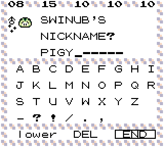
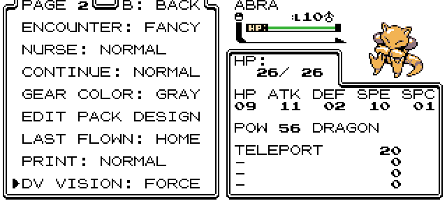

# Common questions

## Is Crystal Clear finished?
- Yes, the hack is fully playable and has been this way since the very first release. The game is maintained by ShockSlayer who releases updates with bug fixes and additional content, including new music, areas, trainers, features, and more.

## When Crystal Clear updates will I be able to keep my save?
- Yes, save data will always be transferable to the next update. Be sure to read \#releases for instructions on how to update properly between versions.

## Is it possible to play Crystal Clear on real hardware?
- Yes! A **GBC** flash cart can run Crystal Clear perfectly so long as it supports save data and RTC. It's recommended to use a modified/reflashable **MBC3** cart with **RTC** for best results. However, **GBA** flash carts *will not run Crystal Clear correctly.* These all use the Goomba GBC emulator, which is *incompatible with vanilla Crystal and therefore CC as well.* You can and should use a GBC flashcart when playing on a GBA.

## What's the best emulator if I'm not using real hardware?
- This depends on what platform you intend to use. The /#documentation channel in the Discord has a list of recommended emulators.

## Is there a translation patch?
- No, and it's not possible to do so in the game's current state. Text data shifts around considerably between each version, meaning that any translation patch would have to start over every single time there's even a minor patch. This is obviously unsustainable.

## Can this game be randomized?
- No, this isn't compatible with randomizers for the same reasons as described above. This may be addressed in the future.

## Are there any new species or moves?
- No. Species and moves are unchanged from Gen 2.

## What about the "Physical/Special Split?"
- Also no. Anything that would break trading, link battles or compatibility with Stadium 2 has been intentionally either left unchanged or will never be considered for addition.

## Can I stream/record a playthrough of Crystal Clear?
- Yes. You may advertise streams or videos in the \#streams channel but only Crystal Clear content is permitted.

# Gameplay Mechanics

## How are trade evolutions handled?
- On the ground floor of each Department Store (Celadon/Goldenrod) is the Tradeback Guy.

- Requirements are unchanged from the original games.

## Are the original 1/8192 shiny odds increased?
- All wild encounters retain the **1/8192** chance (including legendaries and stationaries.)

- The Safari Zone has a buffed **1/4096** chance.

- Gifts, such as the starter, Game Corner prizes, Eevee, etc. have been upped to **1/1024.**
	- The Stationary Aerodactyl in Grullo Gorge also share these odds, being the only exception.

- The Odd Egg, as well as shiny breeding in general is unchanged from the original GSC mechanics.

- See also: [shiny hunting.](Documentation.md#shiny_hunting)

## Can I get \<species\> as a shiny?
- Absolutely! All 251 are obtainable in their shiny forms. However, Unown may only be shiny in the **I** and **V** forms.

## Will the nickname screen display shiny status?
- Yes! The colors will match the shiny form. There will also be a shiny symbol, DVs, and it will play the shiny sound effect!

## I found a trainer with a shiny, is that intentional?
- Yes, enemy trainer parties are never randomized.

## I can FLY anywhere! Is this a bug?
- This is by design. Only a few places are not available by default.

## I went to an area and the levels are too high/low!
- Wild data does not scale. This is an intentional design choice.

## Do the E4 scale with badges? Do they get a buff when you get all 16 badges?
- After defeating the E4 once, a second set of rematch teams will be unlocked. They do not scale with badges and require 8 to be accessible. This has been moved to the Indigo Plateau so that Victory Road can be accessed at any time.

## Should I fight the E4 after getting 8 badges?
- They are stronger in level than the original E4 was, and much stronger than any 8th Gym leader sets. They are also not monotype. Even with the "Switch" option on, you are not allowed to switch when they choose a next party member. Whether you should or shouldn't fight them is entirely up to you.

# How do I...?

## How do I download the game?
- Follow the instructions in the \#releases channel in the Discord.

## Where can I get...?

- For species, press start and use the Dex. In the OPTION tab, you can enable "DEX DOES NOT REQUIRE SEEN DATA" and use the SEARCH tab to get a complete list of locations, obtain methods, and even information for events/gifts/stationaries/legendaries.

- For items, including TMs and HMs, see: [the items page.](Items.md)

- For unlockable music, see: [the music page.](Music.md)

- For starters, see: [the main documentation page.](Documentation.md#starters)

## Where is the Move Deleter/Reminder/etc...?
- See: [Move Tutors and other helpful NPCs](Documentation.md#helpful_npcs)

## How do I see DVs in battle?
- In the second room of Cinnabar Lab, inspect the computer and you'll receive the DV Viewer upgrade. There are several different modes, which can be set from the OPTIONS menu. Pressing SELECT while in battle will also bring up the full viewer.

## How do I change my character after starting the game?
- Visit the Intrinsic Field Generator in the basement of the Goldenrod Dept. Store. You can use the same character customizer as the intro sequence. However, you may not change your name.

## How do I inject a starter/character?
- Use [the injector site.](https://inject.fm1337.com/) A template is provided for character creation. There is also a save pinned in the /#custom-sprites channel in the Discord, which can be used for testing sprites before playing.

- A correctly injected character will show up at the end of the list when using the Character Select Screen. Pressing SELECT on the starter select screen will select the injected starter.

## The injector site says I have more than 4 colors!
- **The site doesn't lie.** If you were careless with your template, you may have shifted the image, or have stray pixels that are slightly different colors than the correct ones, usually due to having anti-aliasing turned on.

## The injector site is throwing an error even though I'm doing everything correctly!
- It's a possibility that either you or the site is experiencing some issues, if something went wrong you ***should*** have received an error message, please pass this error to Allen on discord

## How do I choose my follower in the overworld?
- On the Party Screen press **Select** on a party member to make them follow you!

## How do I speak in the Discord?
- Type "!unsilencehogge" into \#enter-here
- Congratulations! If you made it this far, you should have some basic information that will help you get familiar with what's in the game and what *not* to ask in the server.

## How do I move an emulator save to the 3DS?
- First make sure to use [this](https://inject.fm1337.com/vc-save) to convert your save (.SAV) to a compatible format, then using a tool such as [Checkpoint](https://github.com/FlagBrew/Checkpoint) you can inject the save into your game.

# Troubleshooting

## I traded/transferred a new species from another game but my Dex didn't update. How can I fix this?
- Have your Dex evaluated in Oak's PC and it will add any missing entries so long as you have the species in your current party or the PC.

## My screen turned into glitched graphics! Is this a bug?
- Probably not. This happens often when using inferior emulators, like VBA. There is a routinely updated list of recommended GBC emulators for multiple platforms in the \#documentation channel in the Discord.

## My DVs are the same even though I keep resetting, is this a bug?
- No. Keep in mind that soft resetting is not the same as hard resetting (such as hardware reset/using the emulator reset button) Use **A+B+Start+Select** for soft resetting.

## Is there a list of working cheat codes for Crystal Clear?
- No. You might be able to get certain vanilla Crystal codes to work, but the only guarantee is that there will be unintended side effects. If you choose to do so, do not bother posting bug reports or screenshots in the server.
