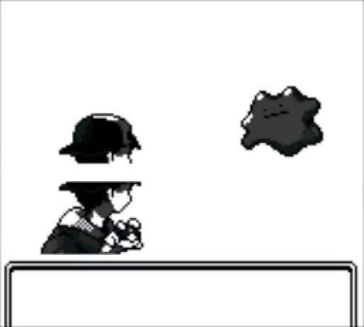

V1.2a:
======
 - Fixed VBA/3DS battle start screen flicker

 
 
 - Fixed Route 12 Gate Psyduck guy using the wrong text
 - Fixed missing waitsfx in Route 24 house
 - Fixed Picnicker Liz having a Nidoking on set 3
 - Fixed Eusine not disappearing after the hole opens
 - Fixed Elm knowing who you are from the Rus call.
 - Fixed Frank's second battle being spammable
 - Fixed Fast Ship warping the player into the water on Vermilion Port
 - Fixed NPCs overlapping on Fast Ship
 - Fixed Olivine Port not setting event correctly if it's your first time coming from Vermilion
 - Moved Fishers around on Route 12
	* Fixes one of them walking on water
 - Moved Psychics around on Route 36
	* Fixes one of them popping in on map load
 - Maybe fixed a rare instance where "Disable music" wouldn't be applied
