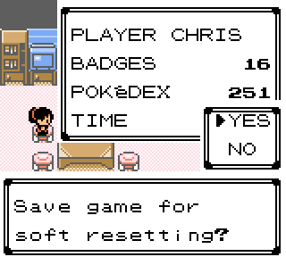

V1.3:
=====

New areas:
----------
*The first instance of Johto Expansion*

 - Cherrygrove Bay
	* Fits in the exact space between Cherrygrove City and Route 32 [(video)](images/1_3_Changelog/CherrygroveBay.mp4)
	* Can surf between Cherrygrove City and Route 32
	* Can use Cut from Route 32 to get to the grass part of the new area
	* Updated world map to reflect this change

 - Cherrygrove Cave
	* 3 floors, each with different wild data (see **Wild Data Changes** below)
	* Can climb on top of the mountains, or ride the waterfalls to the bottom
	* Lots of items, including some on top of the mountains

 - Cherrygrove Forge
	* Part of the SWORD sidequest (see below)
	* Lower encounter rate, rarer wild data

 - Readded The Underground between Route 7 and Route 8

Sword sidequest:
----------------
*"Someone has moved to Cherrygrove Bay. But the house is usually empty? The journal has some recent entries..."*

Completing the short sidequest will earn the player a functional sword
 - Can be used to cut grass, or trees
 - Can be registered to SELECT
 - Prompted to use when talking to a tree

Soft Reset support/Gift updates:
--------------------------------

 - Before certain events/gifts, a save dialogue will pop up
 - Saving here allows you to soft reset to that point directly
 - This affects:
	* Goldenrod/Celadon Eevee
	* Game Corner prizes
	* Kenya (see other changes to Kenya below)
	* Tyrogue (see other changes to Tyrogue below)
	* Dratini
	* Revived fossils
	* Snorlax
	* Sudowoodo
	* Shuckle
	* Celebi
 - Gift text is now shorter for quicker advancing
	* Old: "Give a nickname to the SPECIES you received?" (two button presses)
	* New: "Give a nickname to SPECIES?" (one button press)
 - Kenya has been buffed
	* Has a much better moveset
	* But also a much better reward for finishing the sidequest
	* Can be respawned if you beat the E4 but haven't finished the quest
 - Mt. Mortar Tyrogue now comes with the same moves as starter Tyrogue
	* Mind Reader
	* Hi Jump Kick
	* Mach Punch
	* Rapid Spin
 - Dome Fossil has been moved to Mt. Mortar B1F
 - Moved Strength from starter Ponyta(can't normally learn) to Psyduck(can learn)
	* Ponyta gets Quick Attack instead of Tackle as a replacement.

Hall of Fame sequence now breaks for a moment; the player can save before triggering the resets
 - This allows a second shiny reset spot for any fainted roamers
 - On resetting the shiny sound will now properly play if the newly generated DVs are shiny
	* The shiny sound is now the full number of times, not just one doink.

E4 Changes:
-----------
 - A new team of trainers has taken over the E4
 - Can no longer switch out when the opposing trainer sends in their next pick.
 - Team compositions and held items have been reworked.
 - Something extra happens after the Champion battle

Roaming trainers update:
------------------------
*Added Chronicler Robert:*
 - This mysterious trainer is documenting the wild data across the lands of Johto and Kanto.
 - If you can beat him, he'll share it with you.
 - Will showcase unique moves per location
 - Appears on:
	* Route 28  - (Sunday)
	* Cherrygrove Bay  - (Monday)
	* Route 24  - (Tuesday)
	* Ruins of Alph  - (Wednesday)
	* Route 10  - (Thursday)
	* Will appear on all routes until you've met him, then he'll follow his schedule
 - Don't be afraid to challenge him, he'll heal you if you lose.
 - The first NPC with an idle animation!

GFX updates:
------------
 - Added waterfall spout tile to Clair's gym [(video)](images/1_3_Changelog/Spouts.mp4)
 - New title screen logo and splash screen text
 - Scientist class is now purple
 - New Slowpoke, Slowbro, and Slowking overworld/party sprites
 - Updated Pikachu and Pichu party sprites and normal/shiny palettes (more consistent)
 - Updated Lapras party sprite
 - Updated Sentret and Furret's shiny palettes
 - Pigy can walk around.

Misc updates and changes:
-------------------------
 - Added multiple item quantities
	* "Player found 5 FAST BALLS!"
 - Game version prints on continue screen even if there's no savefile
 - Entei and Raikou are added as SEEN after completing the Suicune event
 - Added smashable rocks to Slowpoke Well B1F
 - Added a Slowpoke on the Azalea Gym roof.
 - The DEX now has more complete fishing/headbutt/gift support
 - Updated Ness team to be Earthbound themed
 - Added a new house in Olivine City
 - Added Berserk Gene, Leftovers, and PP Up as Game Corner prizes in Kanto
 - Slight rework of tiles and trainer layout in Clair's gym
 - Tweaked grass on Route 28
 - Losing to Eusine in Cianwood doesn't end the event
 - Eusine now gloats if you lose to him
 - DV vision is now unlocked from the second room in New Cinnabar Lab
 - Any of the Fast Ferry operators give you the Pass at two badges
 - Youngster Joey now has loss text
 - Frogg can now be battled if you get a high enough score playing Voltorb Flip
	* can fight again after beating the E4
 - If the player chooses to be female, the Mt Silver champions will be Green/Crystal
 - Removed a pesky stone in Fuchsia City
 - Minor house extension in Cerulean City
 - Snorlax can be woken up with a different radio channel?
 - Frank doesn't like cheaters.

New Music:
----------
["Alola Legend"](https://soundcloud.com/user-927422935-571023782/solgaleo-lunala-battle-music-8-bit)

["Eyes of Flame"](https://soundcloud.com/user-927422935-571023782/cave-story-eyes-of-fire-8-bit)

["Splattack"](https://soundcloud.com/user-927422935-571023782/splatoon-splattack-8-bit)

["Misty Mountains"](https://soundcloud.com/user-927422935-571023782/the-hobbit-misty-mountains-8-bit)

["All Star Mode"](https://soundcloud.com/user-927422935-571023782/ssbm-all-star-mode-8-bit)

["Bubble Crab"](https://soundcloud.com/user-927422935-571023782/megaman-x2-bubble-crab-8-bit)

["Contra Boss Battle"](https://soundcloud.com/user-927422935-571023782/contra-boss-battle-theme-8-bit)

["A Moment of Silence"](https://soundcloud.com/user-927422935-571023782/streetlight-manifesto-a-moment-of-silence-8-bit)

["Crash"](https://soundcloud.com/user-927422935-571023782/megaman-zero-crash-8-bit)

["X, the legend"](https://soundcloud.com/user-927422935-571023782/megaman-zero-x-the-legend-8-bit)

["Supreme Ruler"](https://soundcloud.com/user-927422935-571023782/megaman-zero-2-supreme-ruler-8-bit)
 * unimplemented

["X vs Zero"](https://soundcloud.com/user-927422935-571023782/megaman-x5-x-vs-zero-8-bit)

["Guile's Theme"](https://soundcloud.com/user-927422935-571023782/guiles-theme-8-bit) 
 * Goes with everything

"JohtoGSC remix" by Froggestspirit was also added, but is not present on Soundcloud.

Radio updates:
--------------
 - Flute channel in both regions
 - Added "101.1 THE GRAVE"  - only available in Lavender Town areas
 - Added "The Sound of Pig" radio station  - plays random new music
 - Added "24/7 D.A.N.C.E."

Wild Data Changes:
------------------
 - Added Cherrygrove Bay and 4 Cherrygrove Bay Cave levels each with unique wild data

Notable inclusions:

	Outside:
	 - Stantler
	 - Ponyta
	 - Doduo
	 - Tangela
	 - Murkrow
	 - Gastly

	B1F:
	 - Misdreavus
	 - Seel

	1F:
	 - Rhyhorn

	2F:
	 - Gligar
	 - Cubone
	 - Kangaskhan

	Forge:
	 - Magnemite
	 - Magby
	 - Larvitar

 - Changed and scaled down Route 32 and Cherrygrove City water data:
	* Added Poliwag
	* Now Tentacool and Wooper instead of Quagsire and Tentacruel

 - Raichu is now available at night outside on Route 10 North (Electabuzz goes inside)

Water rescaling/reworking:
--------------------------
All areas mentioned have had surfing levels lowered unless otherwise mentioned, species changes are in parenthesis

**Johto:**
 - New Bark Town
 - Violet City
 - Blackthorn City (added Horsea)
 - Ruins of Alph (added Goldeen)
 - Union Cave 1F (added Horsea)
 - Slowpoke Well (added Shellder both levels)
 - Ilex Forest
 - Route 30
 - Route 31
 - Route 40 (added Mantine, levels are the same)
 - Route 28 (added Kingler)
 - Silver Cave Outside (added Kingler)

**Kanto:**
 - Pallet Town (added Wooper)
 - Viridian City (added Wooper)
 - Cerulean City (added Chinchou)
 - Vermilion City (added Chinchou)
 - Vermilion Port (added Krabby)
 - Celadon City
 - Fuchsia City
 - Cinnabar Island (added Mantine)
 - New Cinnabar Island (added Mantine)
 - Route 4 (added Krabby)
 - Route 6 (added Poliwag)
 - Route 12
 - Route 26 (added Goldeen)
 - Route 27 (added Goldeen)
 
Shellder and Horsea can now be found by fishing only with the Old Rod in these locations:

**Johto:**
 - New Bark Town
 - Olivine Port
 - Route 41

**Kanto:**
 - Pallet Town
 - Vermilion Port
 - Route 20
 - Route 21
 - Cinnabar Island
 - New Cinnabar Island
 - Vermilion City
 - Route 26
 - Route 27

Rescaled Cinnabar Mansion:
 - Slugma has replaced Magmar on 1F
 - Flareon has replaced Ditto on 3F
 - 1F is now around the 10-12 level range (for people who want to get Cyndaquil earlier)
 - 2F is now around the 20 level range (to lightly discourage exploration until later)
 - 3F and B1F are unchanged (still around 30-40's)

Rescaled Mt. Mortar:
 - Levels have been reduced on 1F
 - Swinub and Diglett can be found on 1F
 - Larvitar can be found on 1F and B1F
 - Tyrogue(morning), Omanyte(day), and Kabuto(night) can be found on B1F
 - A Dome Fossil can be found on B1F as well.

Headbutt updates:
-----------------
 - Added headbutt trees to Route 45 and 46
 - Added headbutt trees to Cherrygrove City

*Group 1:*
 - New Bark Town (newly enabled)
 - Cherrygrove City (newly enabled)
 - Violet City (newly enabled)
 - Ecruteak City (newly enabled)
 - Mahogany Town (newly enabled)
 - Route 44
 - Route 45
 - Route 46
 - Cherrygrove Bay
	* Removed Spearow
	* Added Spinarak
	* Added Pinsir

*Group 2:*
 - Route 33
 - Route 42
 - Azalea Town
	* Added Natu

*Group 3:*
 - Route 29
 - Route 30
 - Route 31
 - Route 35
 - Route 36
 - Route 37
 - Route 38
 - Route 39
	* Added Meowth

*Group 4:*
 - Route 26
 - Route 27
 - Route 32
	* Added Meowth

*Group 5:*
 - Lake Of Rage
 - Route 43
	* Added Murkrow

*Group 6:*
 - Ilex Forest
	* Removed Noctowl
	* Added Scyther
	* Added Beedrill to both sets

Bug Fixes:
----------
 - Lots of unused data, maps, trainer classes, text, etc. has been cleaned up/removed
 - Reverted a broken fix for "Disable Music" causing music to go out when entering a map
 - Fixed Tradeback Guy using incorrect ID and not respecting shininess
 - Fix shiny Ditto egg having wrong level and exp
 - Fix Safari Zone Guard not moving the player away when the player can't afford entry
 - Fix bicycle moving at normal speed on Cycling Road when "Always Run" is on
 - Fix phone not correctly identifying the League as a registered number
 - Fix wrong music loading when saving and reloading while on the Bicycle
 - Fix a ghost Eusine being left if you lost to him in Cianwood.
 - Fixed missing Eusine loss text.
 - Fix clearing a rechallenge not clearing the correct gym, just Violet Gym.
 - Fix Route 10 Flash Aide reporting a the wrong badges requirement
 - Fix Route 43 Nidoking reference text
 - Fixed HMs always being able to be overwritten.
 - Fix Bug Catcher Wade and Cooltrainer Allen seeing the player offscreen.
 - Fix Starmie doll reporting as Staryu
 - Fixed being able to surf to a place in Vermilion Port that you shouldn't be able to.
 - Fixed a bug with trainer sprite in Radio Tower 4F
 - Fix "here PIKACHU" text
 - Fixed being able to leave the E4 bug
 - Fixed mountain text syntax in New Cinnabar Lab Room 2
 - Fixed Yes/No box overflow glitch?
 - Bazaar/Decoration consoles have had code reworked
 - Fix Raichu not being able to learn SURF and FLY
	* since Pikachu can via event (this does not apply to Pichu)
 - Fixed Shuckie not getting the extra shiny rolls
 - Fixed a Cooltrainer trying to "cath" a red Gyarados.
 - Fixed Dex reporting incorrect/unused surfing information for Cerulean Cave 2F
