# 2.0 BABY CHANGELOG
# CREDITS
This update was brought to you in part by:
### Dynamic Map Palette Application:
 - Kensworth
 - Nephitejnf
 - CatWithHumanEars
 - Grizz
### Cap Girl Design:
 - Tiko
 - Maddalena
### Move Tutors and Trainer Data:
 - Grizz
 - Richard
### Injection:
 - Allen
 - Neph
### Trainer Card Portraits:
 - Gio
 - Kensworth
 - Tiko
 - Maddalena
### Bug Testing:
 - Cedsi
 - Gio
 - Allen
 - Sauce
 - News
 - Jabbie
 - Squid
### Custom Bag Designs:
 - Grizz
### Additional Sprite Work:
 - BloodlessNS (Yellow/Blue backsprite bases)
 - Nic7C5 (Yellow frontsprite design)

## CHARACTER CUSTOMIZATION

The biggest feature in this update is **character customization**  - you
can now pick out your **sprite, gender** and **any two colors that you
want.** Each character even has a preset palette option, and you can
choose from 3 default sets of skin tones and 3 default sets of colors.
There's also a full RGB editor with color values displayed, so you can
share or save your palette information for future runs, or tweak the
values to get them perfect. For those who are more adventurous,
randomization is also available!

 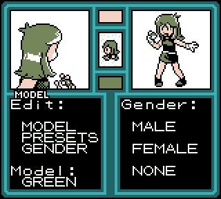

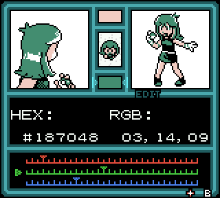 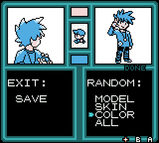

*The character editor is also available from the basement of the Goldenrod Department Store at any time.*

Added **NONE** as a gender option:
 - To preserve compatibility, this option defaults to male when creating caught data, however as long as the player's gender is set to none, no gender symbol will be displayed for species whose ID and OT match the player.

Added **BLUE, YELLOW,** and **LENA** (based off of a female capsule mon beta trainer) as playable characters.

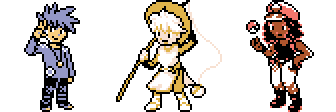

Added new pack design screen, allowing the player to pick up to **60** different custom bag designs, and **8** primary color schemes. You can change your bag style from the options menu at any time.

Certain bag designs are unlocked by events within the game, for a total of 22 different bag designs with multiple alternate colors for each!

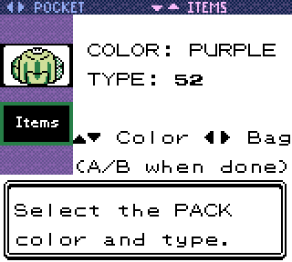 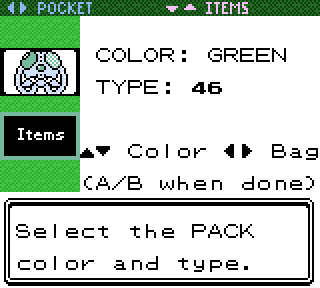

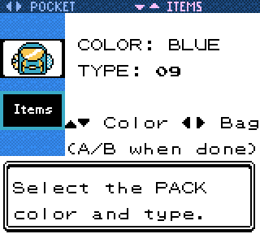 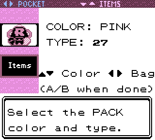

*See if you can figure out what some bags are references to!*

If this isn't enough customization for you, then I have good news. **We've developed an injection system for character sprites!** This includes support for a custom palette as well as the additional new features like enabling/disabling hair flipping.

But why stop at just characters? Many people have expressed a lot of interest in **injecting custom starters**, so we added that as well.
 - If there's an injected starter, pressing SELECT on the starter screen will load it.
 - If it has no set DVs, it'll randomize them (this also takes the extra shiny rerolls into account for SRing)
 - If no moves are set, it fills them in automatically.

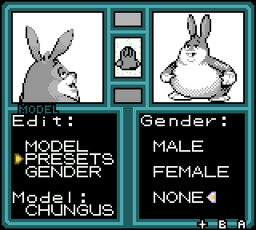 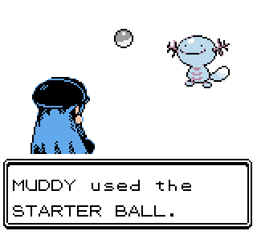

If you're interested in this, check out [Allen's combination injection and patching website](https://inject.fm1337.com/)

**Misc changes:**
 - Intro sequence no longer has a "default name" selection

## GAMEPLAY UPDATES
The entire Safari Zone now has an increased shiny encounter chance of **1/4096.**

Readded the Town Map as the **Region Map** item
 - Can be registered to select to easily check where you are without navigating through the start menu.
 - This will have some expanded functionality later, but for now it's just a helpful map!

Added **BLUEBELL**, and some other secret overworld encounters!

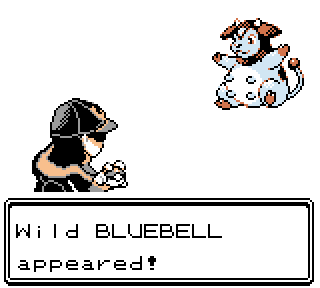 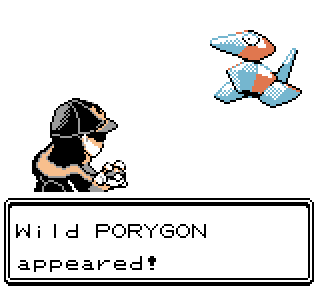

Reimplemented Mystery Gift trainer data - any pre-existing data from previous saves should also work as well.

Added a Snorlax to National Park

Safari Zone Main Office trash can now has a **NUGGET** in it.

*TEAM ROCKET's hideout is in the basement of the GAME CORNER. Oh, wait. That was four years ago...*

## MOVE TUTOR UPDATES
**Reworked Kanto TM Tutor:**
 - Made space and extended compatibility, so it works the way it should have in the first place
 - Several missing entries including those for Gen 2 species were added
 - Can now scroll left and right through moves directly on the party screen to see full party compatibility at once
 - Can hold left/right to rapidly scroll through
 - Also applied these changes to the Event Move Tutor, *Battle Move Tutor*(see below), and the *Unown Shrine*(see below)

**Event Move Tutor** is now free to use!
 - Added some missing Dizzy Punch species from the Odd Egg to the Event Move Tutor

**Added Someone's PC/Grizz's PC:**
 - Available after meeting any of the move tutors, shows up as Grizz's PC after meeting him specifically
 - Can access any of the move tutor move sets and teach them from any PC.

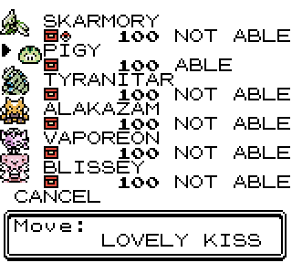 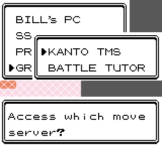

**Added the new Battle Tutor:**

**Grizz:** *"The Battle Tutor is me! Richard and I put our heads together and decided that more choices should be viable for both casual *and* competitive Crystal Clear gameplay. We harassed ShockSlayer until he agreed to join in our judging of what cool new moves should be handed out, adding spicy and powerful options to *more than 200 SPECIES!* I know every species is someone's favorite, and the Battle Tutor will make adventures with your favorites even better! Go out and use it to win some battles!"*

The Battle Tutor also fixes some issues where species could learn a GSC TM move only by breeding
 - For example, Krabby could be bred to learn Dig but was not compatible with the Dig TM.

**SS:** *This feature was also used to expand some HM compatibility. For example, if a species could learn SURF, it can now learn WHIRLPOOL and WATERFALL as well. However, to teach these moves, you must first have the required HM.*

Added **Unown Shrine** to Ruins Of Alph
 - This can be used to teach a few extra moves to Unown to increase their flexibility in general.

## QUALITY OF LIFE
**New DV viewer screen and handling:**
 - Pressing **SELECT** brings up the full DV Viewer:
	 * Shows the wild HP values, DVs, Hidden Power, Moves, PP, and Held Item icon

 - New options:
	 * **OFF** (displays nothing)
	 * **LITE** (old style HUD numbers)
	 * **FORCE** (automatically opens new DV vision screen on battle start)
	 * **ALL** (auto-opens the new screen and displays the old numbers)

**DVs are now printed on the nickname screen** (no DV viewer required!)

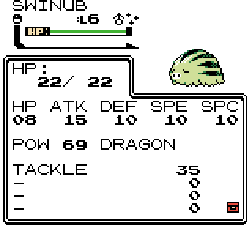 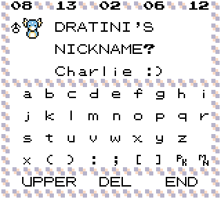

**Reworked the Coin Vendor:**
 - Scroll with the D-pad to pick Coins by 1 or 10
 - Automatically selects max possible amount via filling the Coin Case, or emptying the wallet
 - Displays:
	 * Your current coins and money
	 * Amount of coins and how much
	 * How much you'll have when you're done!

**Can now fish while surfing!**

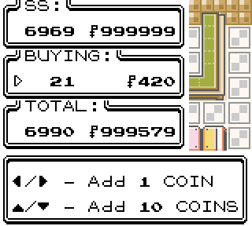 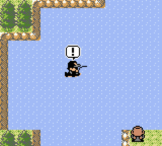

**Stats screen updates**
 - Now displays what type of stats you're looking at
 - Can now press SELECT to scroll through Stats, Stat Exp, and Base Stats(new!)
 - Added displaying N64 buttons next to moves, as well as corresponding party member
 - Stats screen no longer waits for the cry to finish before allowing player to scroll

**Pressing SELECT on the Dex screen now toggles shininess**

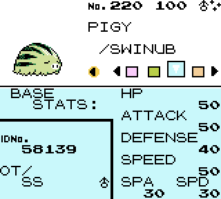 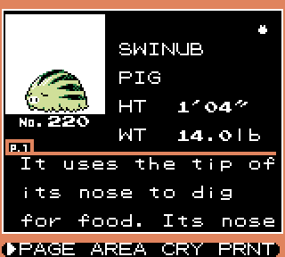

Ported "Press B to highlight RUN" from PolishedCrystal
 - This doesn't highlight run during trainer battles

Improved some SR loops to skip playing sound effects on every reset.

Moved BANK ACCOUNT to a new submenu when accessing the player's PC

Resetting the clock from the menu now immediately saves the new time, instead of requiring the player to enter the overworld and save again

Can now fly to the Mt. Moon Center directly

If the egg the daycare man is holding is shiny, he'll be distracted by the spots before facing the player

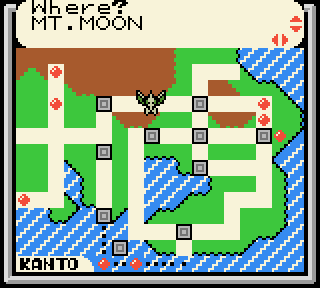 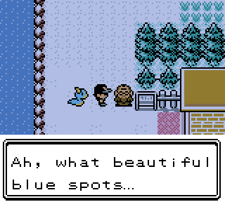

Saying "No" to the Daycare man's egg now resets breeding properly

If it's not already released as shiny, Tin Tower rolls Suicune's DVs on map entry, and displays shininess accordingly

Added an extra signpost event to the left Gym statue in Fuchsia Gym for ease of rechallenging

Throwing a ball in PIGY/CHAMP battles now asks if you're sure you want to use it first.

When getting the Dex rated, Seen/Caught mon are re-evaluated
 - this can be done at any time, and fixes things like Stadium 2/PKHex not setting the correct Dex flags.

Magnet Train animation now waits to press A before finishing
 - This means the train can go faster, or you can take the scenic route with accompanying music.

Implemented handling for additional non-canon landmarks, allowing new areas to be seen on the map and display the landmark sign. This affects:
 - Viridian Forest
 - New Cinnabar Island
 - Safari Zone
 - Cerulean Cave
 - Grullo Gorge *(new to this update)*
 - Cherrygrove Bay
 - Forest Path *(new to this update)*
 - Rose Mountain *(new to this update)*
 - Forest Of Rage *(new to this update)*

## BALANCE CHANGES
**Reworked Route 16's wild data**
 - Levels have been reduced from 26-30 to 6-11
	 * This is to make it more viable for an early-game spot, and to differentiate it from Route 17 and 18 which are harder to get to, but have similar data
 - Slugma is now available at all times of day
 - Ditto can now be found here
 - Slugma can now be found at all times of day on Route 17 and 18, but is easier to find during the day.
 - Rewrote a Lass in Celadon to mention this area

**Kanto legendary birds no longer require 5 badges to appear in their respective locations**

Legendary birds, Sudowoodo, Celebi, Gyarados/Magikarp, Lapras, and Snorlax **now scale with badges.** Starting at level 5, adding 5 per badge, capping at level 60. *(this is higher than before for Lapras and Snorlax)*

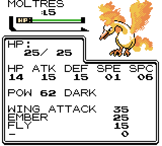 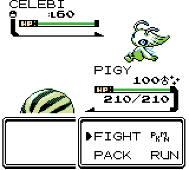

**Moveset updates:**
 - Legendary birds now always have FLY, and Zapdos always has ZAP CANNON
 - Goldenrod Game Corner Sneasel now gets CUT and SURF
 - Celadon Game Corner Heracross now gets CUT and STRENGTH
 - Extremespeed Dratini now gets WATERFALL
 - Red Gyarados now always has SURF, and is a Magikarp at lower levels. The overworld sprite reflects this...you'll have to look closely if you want an early Magikarp!

Moved a Voltorb over in the Power Plant to accommodate attempting to get an earlier Zapdos

Items are no longer permitted during E4 battles, and the E4 themselves no longer use items either.

Doubled Slot machine payouts, with the exception of 777 which instead of being doubled to 600 is now 777

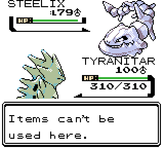 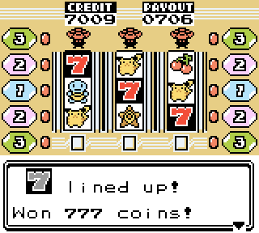

Tweaked Champion's movesets and team order

Replaced incorrect Lv 5 Tentacruel in New Bark with Goldeen, and lowered the New Bark levels in general.

Fix Camper Jerry's Set 7 levels being too high

Goldenrod Center lady won't constantly trade REVIVES for EON MAILS

Update Ace Trainer Tiko's team to 6 members

Ace Trainer Tiko now appears on all days of the week

Bug Catcher Wade now spins clockwise and has a reduced sight range

Removed Badges giving type-based boosts

Replace Beat Up on Blaine, Pryce, and Sabrina's teams with Pursuit, Bite, and Amnesia respectively

Added automatic move generation handling to replace Beat Up with Bite
 - This will only affect enemy trainer Sneasels

"THE CHAMP" now knows Metronome instead of Curse

**Nerfed Hall of Fame:**
 - Now only stores two teams; very first time famers and most recent famers
	* Text will reflect this instead of the old "\#-Time Famers"
 - Older save files will only display the last two recent teams, only overwriting the most recent
 - Entering the Hall of Fame 200 times will now properly display "HOF Master!" on the screen
 - This freed up 2744 bytes in SRAM, which have been planned for use in future updates.

## NEW TRAINERS
Many new trainers have been added to the overworld! Defeat them to receive a gift, gameplay hints, or simply for the challenge!

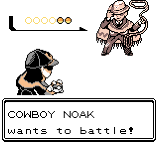 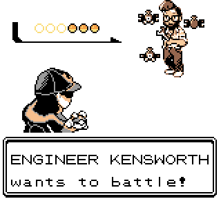

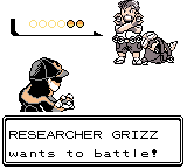 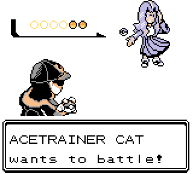

**Added:**
 - DJ Fef to *Lavender Radio Tower 1F*
 - Engineer Kensworth to *Goldenrod Magnet Train Station*
 - Acetrainer Cat to *Safari Zone Area 4*
 - Kid Muddy to *Route 33*
 - Cowboy Noak to *Grullo Gorge* (new area!)
 - Ex-Rocket Zevach to *Silph Co. 1F*
 - Diviner Ryan to *Ruins of Alph*
 - Adventurer Lena to *Blackthorn Silver Cave* (new area!)
 - Trainer Yellow to *Cherrygrove Bay Forest Path* (new area!)
 - Researcher Grizz to *Route 3* (new area!)
	* He can also be found in *Dark Cave*...but only in the **dark**

**Added some new overworld trainers:**
 - Added Youngster Bernie, Youngster Cole, and Teacher Sandra to *Route 2*
 - Added Super Nerd Reid to *Route 24*
 - Added Youngster Alvin and Lass Abby to *Route 5*
 - Added Teacher Jess to *Route 6*
 - Added Lass Lucy and Bug Catcher Victor to *Viridian Forest*
 - Added Youngster Oliver, Melvin, and Alec to the *Ruins of Alph*

**Added our wonderful bug testers**:
 - Bird Keeper Ced to *Silver Cave Outside*
 - Cooltrainer Jabbie to *Burned Tower 1F*
 - Cooltrainer Lily to *Route 8*
 - Cooltrainer Gio to *Route 43*
 - Lass Tiff to *Route 32*
 - Maniac Gustav to *Route 14*
 - Firebreather Allen to *Route 3*

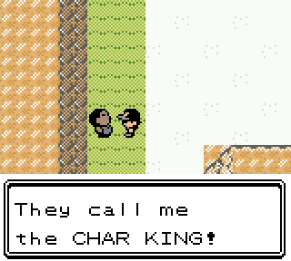

*What? No!*

## MAP CHANGES
### - E x p a n d e d - KANTO

**Added Grullo Gorge!** This map, designed by our very own professor-turned-cowboy Noak, fits right between *Route 6, Route 11, and Route 12.* It even connects to *Route 8* above it through the cave system!

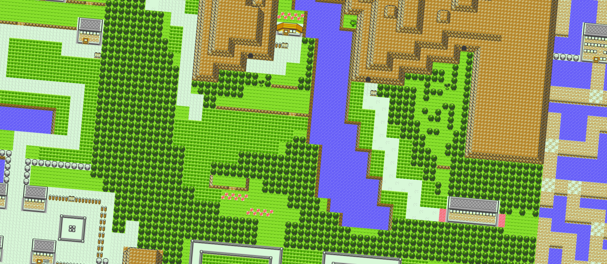

*Yeehaw.*

**Route 25 rework:**
 - Main road now leads to Bill's House and the Fast Ferry
 - Nugget Bridge trainers are now the *NUGGET BRIGADE,* a refightable set of trainers
 - Defeating the NUGGET BRIGADE gives you access to *Bill's Secret Garden*

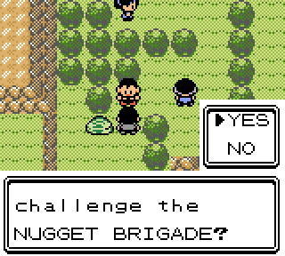 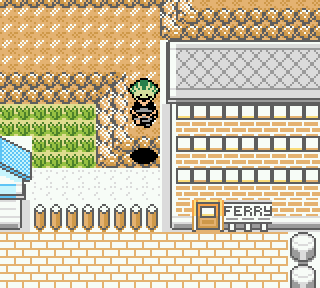

**Updated Route 3**
 - The rowdy pig has now wandered off...
 - Large building is now locked, but there's a flyer over the door...
 - Smaller building is now open, going to **Grizz's Lab**
 - Added a secret ledge shortcut to get across the route without entering Mt. Moon

### - E x p a n d e d - JOHTO

Added **Mt. Rose, Forest of Rage,** and **Blackthorn-Silver Cave!**

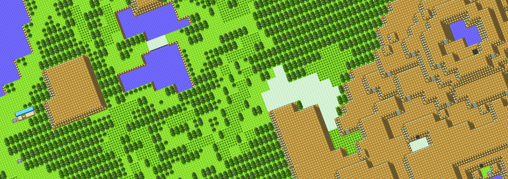

*Scale the mountain to find secret paths, or search the forest for rare treasures...*

**Mt. Rose:**
 - North of Blackthorn, above the Dragon's Den, accessible from secret ledge tiles
 - Tweaked Dragon's Den to accommodate dropping in from above without HMs
 - Catch low-level Espeon during the morning, Eevee during the day, and Umbreon during the night!
 - Cleffa can be found at all times as a 1% encounter

**Forest of Rage:**
 - 1/8192 chance that a secret item will appear in the center of the forest...will you be one of the lucky ones?
 - Igglybuff can be found at all times as a 1% encounter

**Blackthorn-Silver Cave:**
 - Connects Mt. Rose and Mt. Silver both ways
 - Levels are lower than Mt. Silver, but higher than Mt. Rose...so be careful!
 - Additional secret ledge tiles and expansion for Silver Cave Outside
	* This also makes it possible to get to Moltres without HMs!

Added **Cherrygrove Bay Forest Path:**
 - Early game shortcut, providing access to Cherrygrove Bay and Cherrygrove Bay Cave without HMs.
 - Shares the same rare headbutt species as Ilex Forest
 - The only Miracleberry tree in the entire game!

**Minor map tweaks:**

Added an extra tree behind Teacher Sandra on Route 2

Extended the grass tiles on Route 24 into the water a bit more on the bottom, reduced a few on the top

Added a fence next to the house on Route 5, and added a recess in a ledge to enter the house more easily

Fixed some missing water edge tiles on Route 3

Tweaked Burned Tower B1F map and animations to center the cutscene on the screen.

Modified Route 46 cave exit to fix follower digging out animation

Removed two extra boulders on Seafoam Island B3F

Minor tweak to Dark Cave to allow accessing Grizz without Rock Smash

Repel itemball is now a hidden item on Route 32

Very minor tweak to Safari Zone Area 4's grass

Map tweaks to better fit together in the grand scheme of the overworld
 - Pewter City
 - Route 28
 - Route 32
 - Ruins of Alph
 - Violet City

Can now walk behind Doom's bench, thanks to the priority tiles system from Polished Crystal!

## PALETTE UPDATES
Along with the custom player palette, the entire object palette system has been reworked, with palettes being loaded per-map instead of a default set of 8. This allows us to push the boundaries of what the game is capable of and add a lot more color to the overworld, resulting in a lot of nice features listed below:
 - The player now has their own custom palette that can be modified at any time
 - Gym Leaders and other special characters have their own unique palettes
 - Overworld species now all have their correct palettes and aren't limited to 1 per map
 - Decorations now have the proper species palettes, along with some new ones
 - Rocks and other overworld objects can now have custom palettes again
 - The scratch palette is now no longer a shared palette except on a small handful of maps
	* this allows for things like the new overworld shiny animation! (see below)
 - The follower's palette handling was moved into this new system
	* this doesn't change much, but it did get a custom ball palette when it's returned/released

And most importantly, the NPCs and trainers across the overworld now use a dynamic palette building system, consisting of 16 different skin tones and and 16 different primary colors, for a total of 256 different color combinations, compared to the mere 6 colors from before. What's more, these color combinations are reflected in-battle, meaning no two trainers are alike!

**Other palette updates:**

Trainer card now has most Gym leaders reflecting their correct palettes

Trainer card now loads Gear palettes as the primary color

Catching tutorial dude now loads the Cooltrainer M palette

Overworld palettes now use the same Time of Day modification as followers did in 2.0 BETA

Kimono girls sprite colors now match the corresponding species

Stone legendaries now have a special stone palette

Electrode and Mew now use their correct palettes during the Mewtwo cutscene

Scizor now uses an alternate overworld color to better define the sprite

Fixed shiny Aipom's skin color being incorrectly ported

Updated Rhydon and Magnemite shiny palettes

Updated shiny palettes for the legendary birds

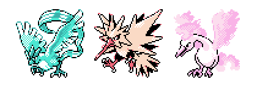

## ANIMATION/ART UPDATES
Added Maddalena's massively improved backsprites for Silver and the Rocket Male/Female player characters

Lots of player front and back sprite tweaks to make them more friendly with a wider variety of palettes

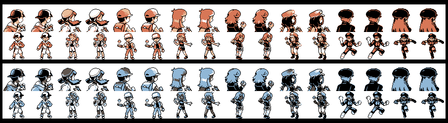

Added new portrait-style card pics

Eusine now has his own sprite design!

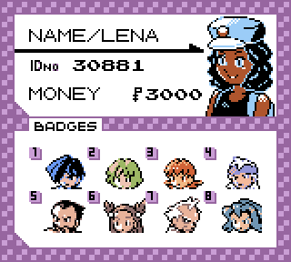 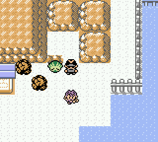

Improved pitfall animation and added proper SFX

All 251 walking species sprites can be used on inside and outside maps now
 - This was more limited before, but as a result the overworld is now more fleshed out.

Tweaked Magnemite menu, follower and battle sprites

The Unown doll now chooses a random letter when loading the player's room!

Updated truck design and gave it a custom palette

Eusine being thrown at the wall has a shaking animation now

Reworked Legendary beasts/Suicune quest to use walking sprites and proper palettes

**Added an overworld Shiny animation!**
 - Followers can sparkle now. (There are a few maps however where this won't happen due to palette limits)
 - Burned Tower B1F (shiny beasts)
 - Tin Tower 1F (shiny beasts)
 - Route 36, 42, and Cianwood City (shiny Suicune event + rechallenge)
 - Cherrygrove Bay Forge Pigy
 - Route 39 Bluebell
 - Grullo Gorge Rapidash

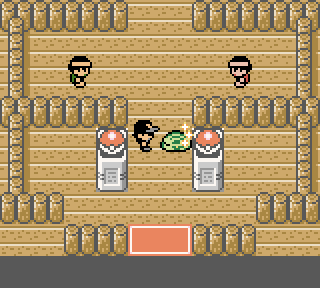 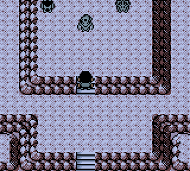

(Note: The Legendary Beasts each roll DVs individually, all three were forced shiny here to display the feature)

Added new Neph and SS in battle sprites

Added new hair to Honeybun's overworld sprites

Updated Chronicler Robert's overworld sprites to properly reflect his hair color

Updated Doom's battle sprites and improved his palette

Certain asymmetrical sprites no longer have the upper 8 pixels flipping back and forth

 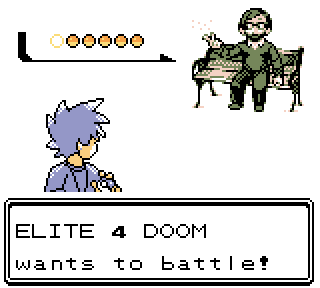

Fixed Teddiursa's party screen mini sprite having the crescent backwards

Fixed Teddiursa's OW sprite not having the crescent

Textured top bar of the pack GFX

Reworked how the pack screen is colored

Redid the pack colors to be more uniform

## FOLLOWER UPDATES
Applied new simultaneous movement technique to teleporting and digging - big improvement and much closer to how HGSS depicts the field moves when a follower is present.

If the follower is standing on a pitfall tile it will also simultaneously play the pitfall animation

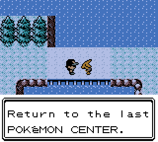 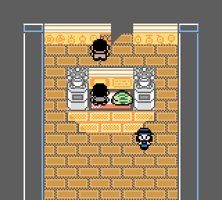

Added proper follower handling to Azalea Town for Dig and Escape rope
 - accounting for Ilex Forest return warp being sideways
 - accounting for Slowpoke Well's odd cave entrance

Added handling to Ecruteak and Violet Towers for digging out with the follower

Entering Burned Tower B1F now forces the follower into its ball no matter what until the beasts are released.
 - The cutscene will also now ball the follower if it's not already.

Added handling for follower picking up the SQUIRTBOTTLE
 - Sets the corresponding events if it happens to pick it up
 - Doesn't allow finding one if you already have one

Follower transform script will now no longer transform into an EGG when rolling Unown, and won't transform into Smeargle

Fixed followers evolving not updating the FollowerObjectTypes, resulting in the X-flip or Hovering bytes not being updated

Fixed hovering followers evolving into non-hovering followers not resetting Y offset

Cycling Road guard scripts preventing player entry without a bike now properly set the follower's action back to stepping

Fixed follower respawning using the bike ignoring the "forced into the ball" state

Fixed missing follower stepping after the Dragon Shrine event

Fixed flying while surfing not resetting follower palette correctly

Fixed non-flying follower not going into the ball before flying

Follower's overworld state is now updated before A presses are checked or Start/Select menus are called

Follower's palettes are updated to the ball palettes manually to prevent some extreme edge-case palette glitches

Hovermons don't have grass tile overlay (since they are flying above it)

*I can fly twice as high...*

## EASTER EGGS
Added a small event to the Pikachu in the Pewter Museum to reflect modern media.

Shuckle can turn Berry Juice into Rare Candy (same rate as Berry into Berry Juice)

Modified Psychic Richard's after text.

Extended Route 36 Suicune cutscene if a follower is present when it's triggered.

After picking up the BIG ROCK, the player can talk to a specific tile in their room to place it on the ground as a permanent decoration.
 - This comes complete with its own cutscene
 - Brock's text is updated to reflect this.

Added Eusine to Route 24 Cave after the Mewtwo quest

Can look over the gate in the magnet train station with Kensworth

Leader Blue might see a lot of *himself* in you.

## MUSIC
**Added the following tracks:**

[Dynamo's Theme](https://soundcloud.com/shockslayer/megaman-x5-dynamos-theme-8-bit)

[Jake Marshall's Theme](https://soundcloud.com/shockslayer/jake-marshall-8-bit)

[Mad World](https://soundcloud.com/shockslayer/mad-world-8-bit)

[Pizza Time](https://soundcloud.com/shockslayer/pizza-time-8-bit)

[BN3 Internet](https://soundcloud.com/shockslayer/mmbn3-network-is-spreading-internet-theme-8-bit)

[Perel's theme](https://soundcloud.com/shockslayer/terranigma-perels-theme-8-bit)

[High Max](https://soundcloud.com/shockslayer/megaman-x6-high-max-8-bit)

[Funky's Fugue](https://soundcloud.com/shockslayer/donkey-kong-country-funkys-fugue-8-bit)

[Endless Stairs](https://soundcloud.com/shockslayer/super-mario-64-endless-stairs-8-bit)

[Nothing Beats](https://soundcloud.com/shockslayer/mmz4-nothing-beats-8-bit)

[Blitz it](https://soundcloud.com/shockslayer/splatoon-2-blitz-it-8-bit)
(special thanks to Haru for creating the drum track!)

[Run Run Run](https://soundcloud.com/shockslayer/gameboy-camera-run-run-run-gsc-8-bit)

[Wily Field](https://soundcloud.com/shockslayer/megaman-soccer-wily-field-8-bit)

**Readded music:**
 - GSC Rival's Theme (Bike)
 - GSC Rival Battle (Trainer/Gym)
 - Rocket Theme (Unlockable for Bike)
 - Rocket Battle (Unlockable for Trainer/Gym)

Added some code from Frogg to enable pitch bend on channels 2 and 3

"Alola Legend" was updated to reflect this

"Blitz it" is the first track to make use of multiple noise sample sets

Diviner Ryan unlocks Cheesy Tetris as a battle theme

Entering the Indigo Plateau will unlock the Crash theme for anyone who's beaten Neph but doesn't have it unlocked from updating from pre-2.0 Beta

Added multiple tracks to *The Sound of Pig*

## TEXT FIXES
**Updated item descriptions for:**
 - Metal Powder
 - Stick
 - Thick Club
 - Light Ball

Using a registered item in the wrong place no longer has Oak calling out the player, considering he is entirely optional.

Brock's slide-in text has been updated

Fixed sign in Olivine City referencing the Battle Tower

Updated text in Cerulean house to reflect Route 24 shiny ditto egg guy

Updated badge requirement text in the Dance Theatre to use "four" instead of "4"

Removed Clefairy doll scripts from Fan club and added boxes reference

Fixed some text errors regarding the communication center and sudowoodo

Alternate Tiko "No room" text

Modified Tiko slide-in text

Relocated badge 5 Kanto birds text to random trainer tips, as they no longer require 5 badges.

Many, many undocumented text fixes in the overworld and for followers.

## BUGS

**Killed Psychic Edmond and restored Psychic Richard to his rightful throne.**

Fixed Cianwood City Eusine using wrong battle outcome text

Fixed green color choice breaking Route 34 daycare palette loading
 - This was also then fixed by nature of implementing the new palette system

Potential bug fix for offscreen standing sprites displaying glitched text/walking frames

Fixed BETH's phone text having a blank paragraph

Fix a bug where trying to run in wild battles read the enemymon's DVs instead of the Player's speed
 - this would result in most battles being escapable, except for when an enemymon has low DVs

Fixed lite DVs display not clearing for battle animations

Removed more battle tower stuff

Changed SR scripts to priority jump (should fix any "auto-press A" bugs)

Gave Ness a visibility event flag to fix him returning after his script when getting on and off the bike or respawning a follower

Fix S.S. AQUA ticket checker not facing the player

Fixed Vermilion Port not loading boulder GFX for pushing the truck

Fixed Gear map using incorrect palettes

Fixed viewing Stat Exp not working in the PC

Fixed Unown starters being given with weird HP values

Fix erasing save file screen not taking no for an answer.

Added "No room" handling to the bundles of hidden repels and hidden rare candies in Mount Moon

Fixed Zapdos event playing again despite it being battled

Fixed surfing on a map with the same music as the surfing music choice stopping the music entirely

Fixed Odd Egg Cleffa and Igglybuff starting with some extra exp for no reason

Fixed Unown in Daycare loading egg sprites instead of their proper forms

Fixed Unown Doll loading egg sprites

Fixed a bug where talking to a Meowth in the Radio Tower would trigger the "Save for soft resetting" dialogue if a save is attempted immediately after

Fixed surfing in Honeybun and Doom's rooms. Fishing is still permitted, and encouraged.

Fibbef's map music is now loaded as the Underground Theme if he hasn't been fought yet
 - This event check is taken advantage of to save on some scripting complications

Fixed entering the music menu after the final battle turning off the music

Overworld key items now reset the follower's Y value (fixes disappearing for things like ITEMFINDER)
 - Phone calls also now do the same thing

Fixed Route 24 map connection error

Fixed unlocking all seen data not allowing the player to immediately scroll through the whole list

Fixed Mt. Moon Square Gift Shop double NPCs appearing.

Replaced RivalName with EnemyName
 - Enemy trainer name is loaded here on battle start, then read from
instead of scrolling thousands of bytes through trainer data each time
 - (For example, to load COOLTRAINER "APRIL," the game would have to seek through 1966 bytes *every time*)

Town map on the wall no longer shows the Battle Tower landmark

Fixed Lapras following sprite being one pixel off

Fixed fishing while biking not loading graphics correctly

Fixed Route 12 map connection error

Fixed Swimmer Kara's sight range being too long

Fix for appear event breaking for gift Eevee in Celadon and Goldenrod

Enemies can't transform if already transformed. This doesn't apply to link battles.

Fixed missing trash can event for Honeybun's house

Post-beasts gramps in Ecruteak City can no longer temporarily trap the player via wandering around

During the Tradeback sequence, the Player's OT name is now correct

Vermilion and Olivine ticket salesmen now update money display correctly when purchasing a ticket

Lucky Number Show now requires a save file before playing (vanilla Crystal bug!)

Fix Bill call mistakenly assuming that if Box 14 is full and Box 1 isn't, then the server is full

Fixed resetting the clock not saving the new time immediately

Fixed Sacred Ash screwing up the overworld palettes

Fixed Dragon Shrine and Dragon's Den having the wrong number of object events

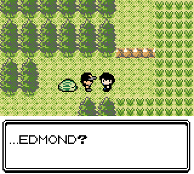

*Finally, his reign is over...*
