# 2.0 BETA CHANGELOG
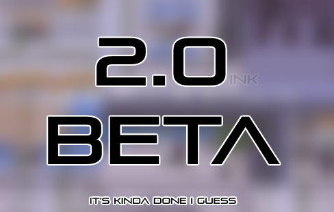

## UPDATE INSTRUCTIONS
**1.** Keep your old build handy if things go wrong.

**2.** On said old build, save inside the Olivine Center, right in front of and facing the nurse.

**3.** Switch to the new build, and load the game.

**4.** Ignore the hallucinations and press A to talk to the "Nurse."

**5.** You will be warped in and out, and your save will be fixed.

**6.** Save the game, and continue with your life.

## COMMUNITY PREFACE
For those of you who have no clue what's been going on, this
section's for you.

Recently the Crystal Clear community was hit with a wave of attention, which sorta set off a chain reaction where it continued to get even more attention. Being a small community of 800 or so, we weren't prepared for or expecting *literally thousands of people* flooding in, and we had to take measures to keep things from getting out of hand. This included taking down the site, and temporarily closing the discord. This caused a lot of confusion, problems, and lashing out at the wrong people, but we were trying to preserve CC's future.

With the added stress and demand, and the decline of my own personal situation, progress slowed down immensely. To get a meaningful release out in a reasonable timeframe, this meant 2.0 dropped down to being "2.0 BETA." It's not my exact vision for the big update, with less than I wanted, but the core engine of followers is done, with a full set of text and plenty to expand upon in future updates. I was also able to squeeze in a lot more bonus material than I was expecting, thanks to the efforts of the patrons and a few other people pitching in.

So with that in mind, here's **2.0 BETA!** It is an ambitious update, and definitely comes with some free bugs.

## FOLLOWER UPDATE
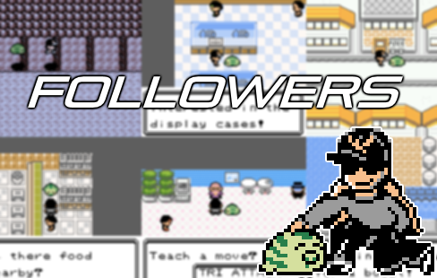

#### Usage:
 - On the party screen, press **SELECT** on the desired party member to set follower
	* This is not limited to first party slot
 - Marked by an **F** (out of the ball) or a **ball icon** (in the ball under certain circumstances) + matching SFX
 - Followers that are fainted, frozen, or asleep won't be allowed out of the ball
 - EGGS can be set as followers, but won't follow you until they hatch

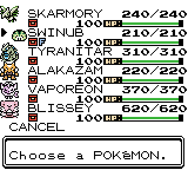
 - Bill's PC/Daycare handling
	 * will remember the follower if it remains in the party
	 * otherwise it will select the same slot, or the last conscious party member
 
 - Followers will gain happiness at 1.5x the rate of the rest of the party when walking with the player

#### Sprites/Palettes:
 - Use proper species palette, basically meaning instead of a default color, it's the actual species palette.
 - Dynamically modified based on time of day

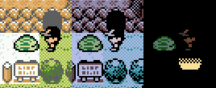
 - Certain species will load a custom palette combination if their design calls for it
	 * For example, Crobat's colors are purple and blue, but looks better with white eyes and a purple body.
 - Full set of 251 walking sprites, including every Unown letter
	 * Many non-follower overworld NPCs now walk around
	 * If a Swinub knows whirlwind, it will have an alternate overworld sprite.
 - "Where?" Flying menu now uses the walking sprite and proper palette

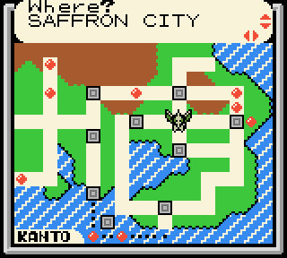
 - Any compatible NPC OW species now use their correct palettes too
	 * This includes the daycare, which thanks to dynamic palette shuffling, alway use the correct palettes for both species, including shiny status.
	 * Certain maps can't support this palette system, so some species will use default palettes.

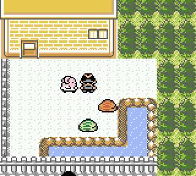

#### Animations:
 - Overworld
	 * Certain species will smoothly hover/fly behind the player

 - Return/release ball animations during certain events (biking, certain cutscenes, etc.)

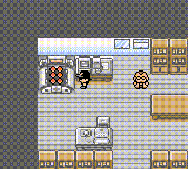
 - Surf - If the follower knows surf, it takes priority for surfing
	 * Moves under player before the player gets on it to surf
	 * Has different SFX for exiting water
	 * Surfing party member is remembered (pitfall onto water, menu, etc.)

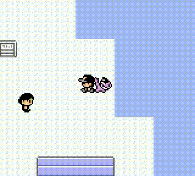
 - Pitfall - if you fall into a pit, the follower will dash after you! and then fall into the hole as well
	 * Hovering Species will have a different animation/SFX when falling from the pits
 - Ice - Ice type followers don't slide on ice, and neither do hovermon
 - Cut/Headbutt/Rock Smash - follower will attack the object in question, with SFX
 - Teleport - You and the follower will spin into the air
 - Dig - You and the follower will spin into the ground
 - Fly - The follower will move into you before flying away with you
 - The follower jumps up onto the desk for the Center healing animation

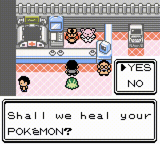
 - After a certain amount of time without moving, the follower will idly look around

#### In battle:
 - The follower will slide in and out, instead of coming out from its ball
 - Certain enemy trainers that have "followers" will also have them slide in and out

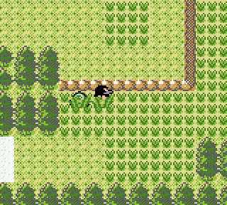

#### Movement:
 - Follower
	 * Player doesn't collide with follower
	 * Follower walks in place
	 * Always tries to face the player(HGSS doesn't even do this, but Yellow did)
	 * Supports ledge jumping (had to add a fast jump and hyper jump animation) + new SFX (+ alt sfx for hovermon)
	 * Follower is hidden when under the player while going through a door or spawning

 - Certain species like Weezing have code to keep their sprites from flipping on the X axis
 
 - If the follower is between you and an enemy trainer, the follower will walk beneath the player to a safe spot (compared to HGSS, which doesn't let the trainer spot you, which makes no sense)

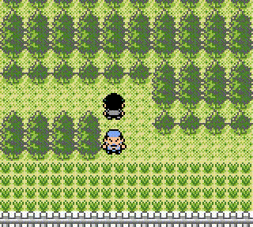

#### Interactions:
 - Priority system
	 * Certain conditions will cause the follower to react accordingly, like low HP or a status condition.
	 * The last interaction is saved, so you'll never get the same interaction twice in a row
 
 - Recent Events
	 * The follower is paying attention to what you do! Many NPCs and overworld events have corresponding text.
 
 - Caught Location
	 * Your follower knows when it's home.
 
 - Species
	 * Lots of text has been written by the patrons based on the Dex entries. Every species is different!
 
 - Traded OTID
	 * Your follower remembers where it came from. Maybe it misses its original trainer from time to time?
 
 - Shiny
	 * Huh? Did PIGY just sparkle a little bit?
 
 - Current Map
	 * What's going on in the world around us?

 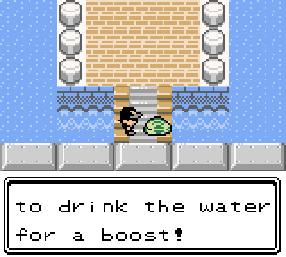
 - Tiles
	 * Huh? Did something rustle in the grass?

 - Type
	 * What would certain typed species be doing?
	 * Random between dual type species

 - Personality
	 * Every species is different, so what's this one like?

 - Time of day
	 * Is the follower excited to start its day, or is it ready for bed?

 - Moves
	 * TELEPORT has a random chance to bring back an item.
	 * HGSS: "...Oh? DITTO's appearance... Didn't change!" CC: ( ͡° ͜ʖ͡°)
 
 - Items
	 * If the follower isn't holding an item, there's a chance it'll pick one up!
	 * Certain species might even be better at finding certain items.
	 * Certain species that hold evolution stones might have a difficult time...
	 * PIGY is munching on the LEFTOVERS.
 
 - Squirtbottle can be used on the follower for a different reaction based on typing
 - Talk to the lady in New Bark Town with Lugia as your follower
 
 - Animations:
	 * Follower will hop around, look around, look away, etc. during certain interactions

 - Many more interactions and texts to discover!
   
## NEW GAMEPLAY

### New Player Characters:
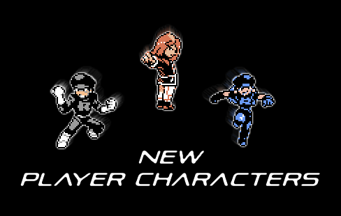

 - Added Silver, Rocket Male, and a Redesigned Rocket Female
 - Repurposed Underground Warehouse to character changing room

### New starters:
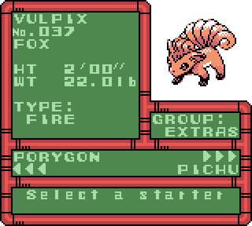 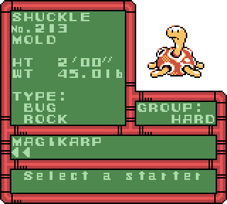

 - Added Vulpix as an Extra starter
 - Added Shuckle as a Hard starter

### New trainers
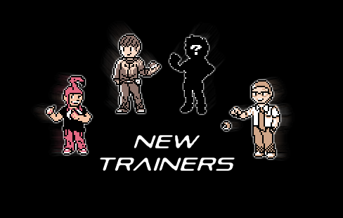

Added **Fibbef** and **Neph** to the overworld:
 - Both are visible in all locations until you've met them once, then they follow their schedules

**Fibbef:**
 - MONDAY - Mt Moon B2F
 - TUESDAY - Route 7
 - WEDNESDAY - Cinnabar Tunnel
 - THURSDAY - New secret area within Mt. Silver

**Neph:**
 - WEDNESDAY - Viridian Forest (speedrunners might want to check this encounter out)
 - FRIDAY - Route 28

Added two **Ace Trainers** to the overworld:

**Ace Trainer Richard**
 - He loved the Battle Tower, so he's close by most of the time.

**Ace Trainer ?????**
 - Good luck finding this one!

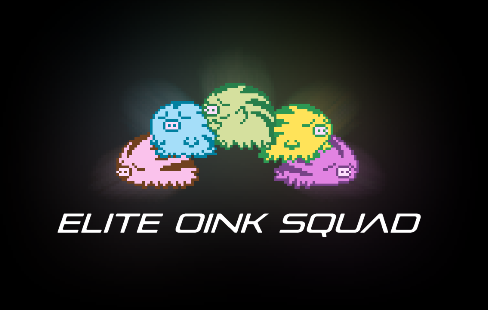

4 oddly colored SWINUB have been released into the overworld...
 - Can you find all 4 and collect your reward?

### Misc additions:

**Kanto TM Tutor:**
 - In Lavender Radio Tower, will teach Kanto TMs to species that can't learn them any other way
 - This means that since Chansey can learn softboiled via level up, it can't learn it here
	 * This is to save on data, as well as reduce redundancy

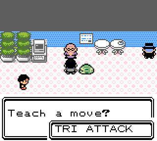

**Cinnabar Tunnel now has wild data:**
 - Similar to the first floor of the Mansion, except lower levels, and no ditto
 - There's an extra 4% chance to find Cyndaquil(which is offset by the low encounter rate)
 - Surf data is currently the only way to get Shellder in Kanto without a rod

 - The Red Gyarados now swims around in the Lake of Rage
	* It can swim all the way to the shore, meaning you can catch it without SURF
	* Also has its own special swimming sprite now

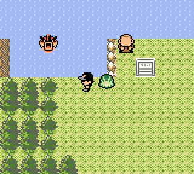

 - Added **THE CHAMP,** unlocked after beating the E4 rematch
 - Zapdos will now spot the player as you surf past it
 - The Cerulean Slowbro now uses a unique method of CONFUSION
 
## BALANCE CHANGES

#### Starter buffs:
**Chikorita:**
 - Replaced Miracle Seed with Focus Band
 - Replaced Growl with Ancientpower

**Bulbasaur:**
 - Replaced Razor Wind with Petal Dance

**Totodile:**
 - Replaced Razor Wind with Rock Slide

**Pichu:**
 - Replaced Bide with Encore

**Slowpoke:**
 - Replaced Twistedspoon with Leftovers

#### Other changes:
 - Fixed Blue's Wartortle/Blastoise keeping Bubble too long in sets
 - Can no longer surf in Gyms
 - Kenya and Shuckie can no longer be taken from the player
 - Tuscany now appears on Tuesday regardless of badges

 - Any species with a 1:7 gender ratio will now be treated as 50% when not in a link battle/trading.
	 * This means species like Eevee can now be both shiny and female
	 * This also applies retroactively.

 - Silver Cave first room now has night palettes, instead of requiring flash

 - Cooltrainer April in Blaine's Gym now faces right instead of down

 - Dragon Fang is now available for purchase in the held item marts, and now has a more accurate description

 - Prof.Oak can only be battled once a day

 - When the game tries to generate an egg, it rolls an extra time.
	 * After beating the E4, it will roll a third time if the first two don't succeed.

## MAP CHANGES
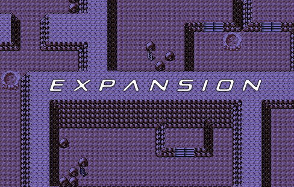

**Mt. Moon E X P A N S I O N:**
 - Mt. Moon has been expanded to its original size, with some much needed GFX updates
 - New trainers
 - Plenty of visible and hidden items (some are so hidden not even the ITEMFINDER can find them)
 - Lots of smashable rocks
 - A few new areas were added for accessing Mt. Moon Square
 - do not anger helpful pig

**Route 3 Center** is now open for business
 - You can even buy a special Magikarp

**Saffron City:**
 - Buildings are now the correct designs
 - Fixed roof palettes
 - Some modern design tweaks to improve the overall look
 - The surrounding routes received some minor tweaks to accommodate the changes
 - Added signs to reflect exits

**Viridian City:**
 - Cut out part of the ledge to make the Gym more accessible
 - An old man was moved as well to help with this

**Viridian Forest:**
 - Added a pond

**Route 28/Outside Silver Cave:** 
 - Can no longer climb up the ledge to go back, instead have to walk all the way around
 - Removed some cut trees, and added a single cut tree shortcut
 - Updated Old man text to reflect area changes

**Minor changes:**
 - Added extra headbutt trees to Route 33
 - Added extra headbutt trees to Route 38
 - Slight Route 42 tiles update
 - Cianwood City loses a smashable rock.
 - The granny in the Bazaar has vanished.
 - Fast Ferry buildings now have FERRY written on the outside
 - Remove the lines on the roofs of Pewter Museum and Lavender Radio Tower
 - Route 2 Gate is now Kanto themed
 - Route 40 reworked to look more like its G/S design
	 * Since the battle tower was removed
	 * Also fixed a game breaking bug where you could surf from Route 40 onto the Olivine map connection
 - Cinnabar Tunnel is now the night palette
 - Ice path and the Seafoam Islands are now the day palettes
 - Very minor changes near Route 10 North's Rock tunnel entrance
	 * Also added boulders near the edge of the Power Plant
 - Moved Cerulean City ledge down one
 - Ecruteak dance theatre is now a little bit longer, to help reduce the amount of on screen objects
 - Added a waterfall to Lugia's chamber
 - Tweaked Dragon shrine a little bit
 - Goldenrod Dept Store B1F is now more open
 - Spooky boi in a place

## NEW FEATURES
**Party Screen:**
 - Palettes are dynamically loaded instead of picked from a default set of 8
	 * This means each party member has its exact palette, including shininess
 - Dynamically loading palettes meant almost all of the sprites required updates, which they received.
	 * This includes a new set of 26 individual Unown sprites!
 - Mail and Item icons are now static, and no longer cover the sprite
	 * This doubles as a workaround for the "item color flashing" bug

**New character select screen:**
 - Displays the OW sprite, back sprite, front sprite and current color.

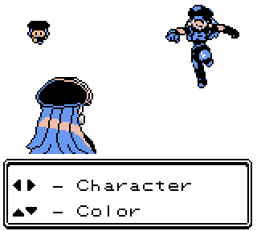

**Surfing updates:**
 - Music fades out before surfing music starts
 - Now has new SFX when entering water
 - All player sprites now have individual surfing sprites, instead of a shared generic one

**Reworked 4th stats screen to be more organized:**
 - Now shows hidden power type and attack power
	 * Please note that this uses the actual in-game code to calculate the values, so it's accurate.
	 * There are a few online calculators that are incorrect, so don't use them to report a bug.
 - DVs display horizontally(now more in-line with the in-battle DV viewer)
 - Combined the met time and level lines
 - Shortened some of the flavor texts to fit on one line
 - Press SELECT to print STAT EXP on the 3rd/blue stats screen
	* also displays a star when STAT EXP is maxed.

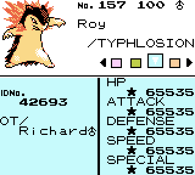

**Music system rework:**
 - Music can now be unlocked by hearing it in certain trainer battles
 - Music titles are now shown on the Gear radio
 - More regional music

**Misc:**
 - Cured 'Rus now shows a dot by the gender icon as well
 - Leftovers doesn't print text anymore when it activates
 - Two tiles of grass on Route 34 can be permanently cut
 - You can now release Eggs
 - Added instant text (TEXT SPEED: NONE)
 - Pressing "RESET CLOCK" on the main menu no longer asks for confirmation.
	 * When the clock is not set (but a save file exists), the game will skip the intro and go to the Main Menu
 - Added some secret fishing spots and several new fishing groups in secret areas
 - Added password system for tournament entrants and winners to obtain prizes and custom starters
	 * Can also be unlocked later at the Mahogany Bazaar
	 * Tournament entrants and winners can use these passwords to inscribe the trophy decoration
 - League number now presents a menu, with an option to disable calls

## SHINY/ROAMER HUNTING BUFFS
 - Fleeing species won't try to flee if they're shiny
	 * This does not apply to roaming legends, who will stay shiny even if they flee.

 - Can no longer run from any shiny, even with a Smoke Ball
	 * (not being able to run from shinies was originally limited to the red Gyarados)

*With the exception of Roar, the following roamer instances mostly apply to Mew's Metronome*

**Hi Jump Kick/Jump Kick:**
 - If a roamer or wild shiny misses, it won't take crash damage
 - "MEW kept going and landed safely!"

**Selfdestruct/Explosion:**
 - Always fails if used by a roamer or shiny

**Whirlwind/Roar/Teleport:**
 - Fails if used by a shiny
 - Roamers, even shiny ones, can still use these(since DVs are kept)

**Perish Song:**
 - Fails if used by a roamer or wild shiny

**Curse:**
 - Fails if used by a shiny
 - Really only for ghosts but a shiny Slowpoke would still fail.

**Take Down/Double-Edge/Submission/Moves with Recoil:**
 - Fails if used by a roamer
 - Fails if used by a wild shiny

**Struggle:**
 - Is handled slightly differently than the other recoil moves
 - Struggle will work normally until enemy HP is red
 - It will then fail until you're out of balls
 - When you're out of balls, it will resume working normally to prevent soft-locks
 - This is for weird instances like wild shiny Smeargle missing sketch
 - Or longer battles where a lower catch rate drags things past max PP
 
## MINOR TWEAKS
 - Lt. Surge now plays Guile's theme in place of selected gym leader theme
 - 8th Gym Badge call suggests continuing Gym Challenge  
 - Added single color stone sprites for all of the roamers
 - Silver trophy now uses the silver palette instead of the removed black/white one.
 - Can no longer use dig/escape rope to leave Burned Tower B1F or Cinnabar Mansion B1F
 - The Legality Fixer will now fix the shiny Ditto egg's OTID to EVENT, 08192
 - The Kimono girls overworld sprites now match their Eeveelutions
 - Many overworld sprites have been tweaked or moved around
 - Alternate title screen unlocked after beating the final trainer
 - Final trainer can now always be refought, and doesn't always override original trainer
 - Remove DST setting in intro sequence
 - Added SYDNEY, for some reason.
 - Added tops of Gym leaders heads to trainer card
 - Cherrygrove Bay House Natu spins in place.
 - SS's sprites have received redesigns
 - Cleaned up and redid some movement for the Mew and Mewtwo events
 - Moved The Guru away from the console vendor
 
## BUG FIXES
 - Fixed the Move Deleter screen using the wrong set of sprite palettes
 - Fixed party screens loading incorrect palettes when trying to teach a move
 - Fixed Viridian Forest Bug catcher's "!" appearing offscreen when he sees you
 - Fixed Ferry Service chairs not having proper collision data
 - Fixed Lavender town south connection not being smooth
 - Fixed Route 12 gate having incorrect warp collision data
 - Fixed double fade on Goldenrod/Celadon Move Tutor
 - Fixed many overworld sprite errors
 - Fixed falling onto water via pitfall(Seafoam) not bothering to check if surfing species is Pikachu
 - Fixed a bug with Chaos' script not giving the promised item if there wasn't space before
 - Fixed a bug where GiveEgg would set/clear the wrong flags (this is an undocumented Crystal bug)
 - Fixed start menu trying to print the current version when in the bug catching contest
 - Fixed music randomly restarting when disabled from the menu (most likely)
 - Fixed resetting the music from the menu also resetting Dex mode and un-unlocking DV display
 - Fixed an infinite Celebi SR loop
 - Fixed Frogg battle not setting event
 - Fixed player being able to input movement just before E4 and Cinnabar Mansion cutscenes
 - Fixed Suicune jumping on Psychic Mark (who has been moved down by one)
 - Route 42 Suicune checks Y coord, and jumps down instead of up if you're coming from above
 - Moved Psychic Jared over one tile, so he doesn't pop into the map
 - Fuchsia gym trainers now reset to Janine on map reload
 - Radio now properly skips the HONEYBUN trainerclass
 - Fix the last talked NPC in the Celadon prize room facing the player when using the vendors
 - Fixed New Cinnabar Island Terminal not setting last spawn point
 - Officer trainerclass now uses the proper encounter theme
 - Binoculars won't show Articuno after it's caught.
 - Turning consoles off in the Bazaar now works correctly
 - Fixed Scientist Justin's OW sprite not being purple
 - Updated Jasmine's Steelix's moveset to fix the happiness bug
 
## KNOWN BUGS
**Followers:**
 - Surfing follower displays ball icon even though it's "out"
 - Surfing follower doesn't slide into battle even though it's "out"
 - Follower sprite falls behind player during pitfall animation

**Other:**
 - CC no longer has the Gold SGB border, but Stadium 2's GB tower will load a default one with no issue.
 - Hollow cursor disappears on party menu screen during SWITCH
 - Certain trainer names take longer to load than others
	* This is because it has to scroll past all the other scaling trainers first

## NEW MUSIC
 - Added [BN5 Battle Theme](https://soundcloud.com/shockslayer/mmbn5-virus-battle-8-bit)
 - Tweaked "A Knight's Oath" theme a little bit
 - Added TCG Ronald's theme (Danny-E 33)
 - Added TCG Pause Menu (Danny-E 33)
 - Added Colosseum Cipher Peon (FroggestSpirit)
 - Added Spiky Eared Pichu (Mmmmmm)
 
## TEXT FIXES
 - Lots of text formatting has been updated to reduce amount of button presses
 - Fixed "BY BY" in the Celadon Game Corner Prize Room
 - Fast Ship first-time quest now just says "our destination" instead of only Vermilion City
 - Route 8 Biker no longer refers to the player as a "punk from JOHTO"
 - Removed outdated Viridian Center reference to destroyed Cinnabar
 - Fixed a text overflow bug in Red's house when the mom mentions GREEN
 - Fixed an EXPN CARD reference in Lavender Center
 - Fixed "atleast" in Sprout Tower
 - Fixed odd reference if FALKNER is the last gym leader you face.
 - Fixed many ellipsis being 3 periods instead of the correct single character
 - Fixed a trainer on Route 42 oddly referencing using a MOON STONE
 - Minor Charcoal Kiln Farfetch'd text fix
 - Renamed BUG CATCHER JOSH to BUG CATCHER SERGI
 - Fixed player-specific text references in Gold's House
 - Minor introduction text fixes
 - Bazaar Rocket "cant" text fixed
 - Fixed Dome Fossil printing "Oak: Not the time!" text twice
 - IVAN now tells the player to take a walk.
 - PIGY no longer blows the winds of change.
 - Silph Co. Guard now acknowledges the Dept Stores selling the UP-GRADE.
 - Fixed some text formatting in New Cinnabar Gym
 - Fixed "last of SAGES" text
 - Expanded Saffron City's "trouble at the power plant" text
 - And more!
 
## BACKEND CHANGES
*(For those curious about development things)*
 - Remove the dummy game
 - Remove some unneeded Mystery Gift stuff
 - Load $ff into hCGB if playing on GBA
 - Berry trees are now signpost events and map tiles, instead of objects like NPCs
 - Emotes and Grass now share the same object palette
 - The jump shadow palette now uses a different palette since it's just the black color
 - Palettes have been shuffled around a bit
 - Shuffled around a lot of code to make space
 - Music system now saves and loads song IDs rather than 0-8 values (much faster loading)
 - Music system is now table based so adding unlockable tracks is very easy
 - Added lenny face to inverted font and MMX font
 - Added 4 new movement types for OW NPCs (stepping up/down/left/right)
 - Route 3 and Route 4 are now split up
 - Route 4 starts as soon as you exit Mt. Moon
 - Removed unused Safari Zone stuff
 - Fixed a weird bug where larger sprites would screw up the intro sequence due to not clearing VRAM
 - GBC only screen reworked to have more accurate text, plus removed GFX for space
 - A lot of the custom character stuff was consolidated and rewritten to suck less
	 * This included some naming inconsistencies
	 * Some custom color stuff still uses the old implementations however
 - Removed unused movement data from the Dragon shrine
 - Cleaned out a lot of unused blockdata and mapscripts
 - Whiteout error handling now spawns based on region choice, instead of SPAWN\_HOME
 - During healing machine animation the dynamic OW NPC palettes dynamically switch to the followers and back to avoid animation weirdness

**Overdue Overworld Overhaul:**
 - Connecting MapGroups are kept between spacers and notated as such
 - Sprites are notated on where they appear
 - Redundancies and unused sprites have been eliminated
 - Total number of sprite types are now listed 
 - Implemented the 3 new standing sprites to reduce total number of walking sprites to at least less than 8 per mapgroup
 - Swapped out some NPCs in key areas to reduce total number of walking sprites
 - A few NPCs have moved around to accommodate the changes
 - To make space for an extra walking sprite(followers), certain common walking sprites now have standing variants
 - Cleaned out some mobile leftovers

## PATRON THANKS
Before getting onto the credits, I want to give special thanks to all the patrons. Not only were many of them interested in supporting me directly, but also went above and beyond to put in time and effort to help fortify the update. They wrote text, beta tested, gave feedback, love and support, and for that, I am truly thankful. These outstanding individuals are the reason that this update is here today, because without them, it would still be very far away.

## CREDITS
**comet** - Original followers concept code (super helpful, even down to the "todo list.")

**MegamanOmega** - Base 250 + 26 Unown walking sprites, incredible work.

**Polished Crystal** - follower ball design

**nephitejnf** - Route 3 Center map scripts, lots of text formatting, follower text

**Prism** - Real-time day/night palette modification code

**sergi** - Many many text fixes as always, gym leader sprite head updates

**Richard & Blaziken** - Coordinated and wrote the majority of the follower species text. Compiled the optimized Kanto TM Tutor list. A legend.

**Noah** - Mount Moon maps, follower text, general *E X P A N S I O N*

**Tiko** - Follower text, beta testing

**CatWithHumanEars** - Follower text, beta testing

**Bee Prince Vance** - Follower text, beta testing

**kaBoMBer** - Follower sprite edits, beta testing

**BloodlessNS** - Information on followers

**raining_blood** - Information on followers

**RyTu** - Overworld sprite verification, beta testing

**Fibbef** - Overworld sprite verification, beta testing

**Amy (The Spectral Princess)** - Changelog proofreading
