# Credits

## Credits:
 - **Grizz** - Battle Tutor updates, trainer sets, footprint and intro screen graphics, nickname palettes
 - **Kensworth** - Lots of music optimization
 - **Muddy** - The majority of the nickname palettes
 - **Nephitejnf** - Footprint data implementation
 - **Tiko** - Footprints concept
 - **Maddalena** - Many new front sprites, lots of Cafe tileset gfx
 - **ShinkoNetCavy** - Gen 8 Gym Leader theme
 - **Rangi** - Lots of code optimizations, additional wave samples code, Cafe gfx refinement
 - **Allen** - Injector updates
 - **Sauce** - Dex Gear design

## Bugtesters:
 - **Cedsi**
 - **Rytu**
 - **Jelestine**
 - **Bee Prince Vance**
 - **CatWithHumanEars**
 - **Casual**
 - **Jabbie**
 - **Gio**
 - **Lamanitekmg**
 - **Lily News**
 - **Omega Fef**
 - **Pies**
 - **RBL Joker**
 - **Smelly-Ghost**
 - **TreeSquid**

And a special thanks to all those who reported bugs in the Discord server!

# Introduction

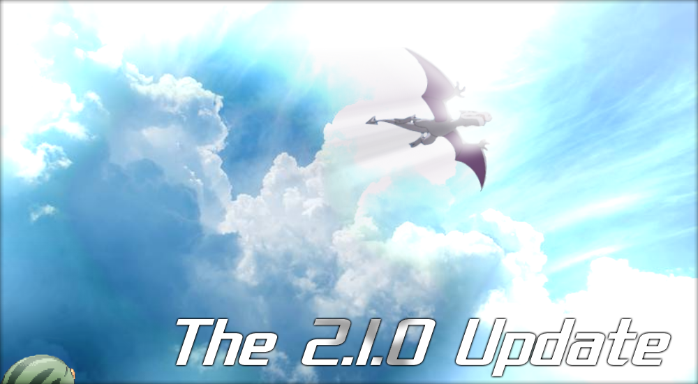

It's been well over a year since the last update, 2.0 BABY, was first launched into the atmosphere. With the end of the last bugfix update came the liberation of my focus, which was necessary to take care of obstacles that required undivided attention. But slowly, gaps started to form, opportunities presented themselves, and gears began to move.

With every update, I try to solve problems that exist within the game, not only by fixing bugs, but by refining features and gameplay concepts as best as I can. And each time, I try to find some way to push myself, whether it be writing better code, hunting down and fixing complicated errors, or even just spending the long hours necessary to grind out things like music optimization. Some of the ideas that have finally reached fruition have been in the pipeline for eons, even before the _last_ update. 

This update is the 2.1.0 update. No fancy title, and we're up to three numbers now - this is because in the past, major updates have been followed by smaller bugfix updates, occasionally adding a new song or small feature. There wasn't an in-game identifier that made it easy to check which bugfix update you were on, which led to confusion. So now, when those updates come, the aforementioned 0 will turn to a 1, and so-forth.

# New features

## New Dex

One of the most frequently asked questions when playing CC is, _"where can I find x species?"_ And of course, there are tons of follow up questions regarding the learnset, evolution, and frankly basically any other possible information about said species. While the documentation does the best it can to handle these questions, it's not a perfect solution. However, I think I've been able to create something that's close.

CC now features its own custom Dex. This is the largest coding project I've ever undertaken, and was written entirely from scratch. It's designed to display as much information as possible, and give the user a readily available encyclopedia in-game at any time. Beyond that, it features several additional resources, tools and customization options to supplement the information and let you tweak your experience to be exactly what you want. And since it reads from the data in the game, you know that what you see is always accurate, compared to information available online.

As this is the major new feature of the update and there's a lot to cover, I've made a video that follows along with the in-game tutorial and explains some of the more detailed aspects. I hope you enjoy it!

[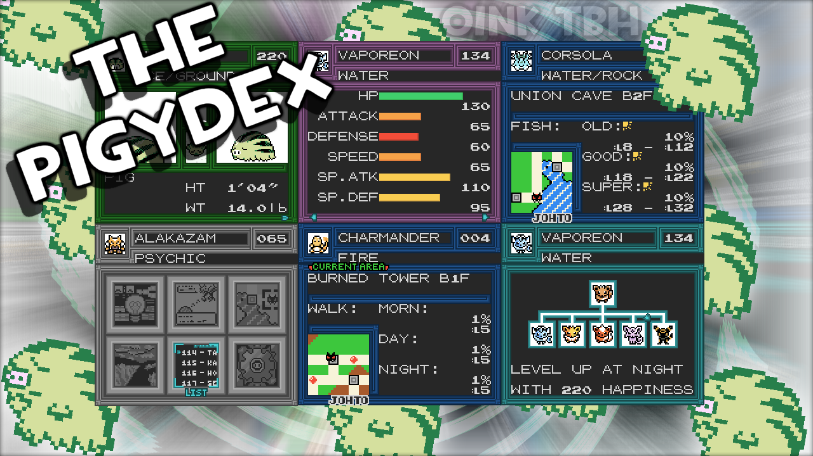](https://www.youtube.com/watch?v=4-W5CGU_h9s "The Pigydex")

[(Youtube Video)](https://www.youtube.com/watch?v=4-W5CGU_h9s "The Pigydex")

Things that have been added since the video:
 - Dex info tab now displays caught Unown forms, and the currently selected letter.

## Residences

Since the very first release of CC, starting towns has been highly requested, and now it's here. No longer are you limited to New Bark or Pallet, _you can now start in any town you want!_ In the past I've always made the argument that having starting towns would add a lot of balancing difficulty to the wild data, but as the game has developed more with new, lower-level areas and more options available to the player, starting anywhere has become more reasonable. Granted, some places will still be more difficult than others, so a difficulty meter has been added during the selection sequence.

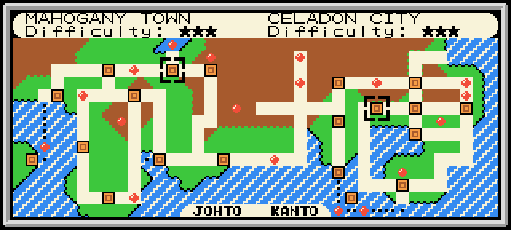

This feature is more than just starting towns! Now, you have your own _residence._ Each residence works just like the decoration system, but every map is unique! Some residences may be more lavish in design, others may grant you access to secrets or shortcuts. And if you get bored of your starting town, don't worry - you can always move to a different residence! There are even a few extra residences in the overworld that aren't accessible from the start, so keep an eye out!

To further expand the residences system, a new item has been added! You now have access to a **HOUSE KEY!** Aside from granting you entry to where you live, you can activate this key item to immediately travel to your residence, provided you're outside and have a party member that knows **FLY, TELEPORT,** or **DIG.** You can also choose to consume an **ESCAPE ROPE** if you don't have a suitable party member. This allows you to quickly travel back home anywhere in the overworld, and also provides a new fast-travel option for teams that don't support any of the transportation field moves.

### Additional changes:
 - Decoration carpet now covers the entire floor, even under the tables.
 - The BIG ROCK is now an interactable object.
 - Certain residences have an expanded TOWN MAP, allowing you to inspect individual regions.
 - Beds now heal the party and have a matching sound effect for each type.

## Footprints

Have you ever wondered what was up with the Dex displaying footprints? Ever wanted to track down a species using them like an expert hunter? Well, now you can - footprints have come to the overworld!

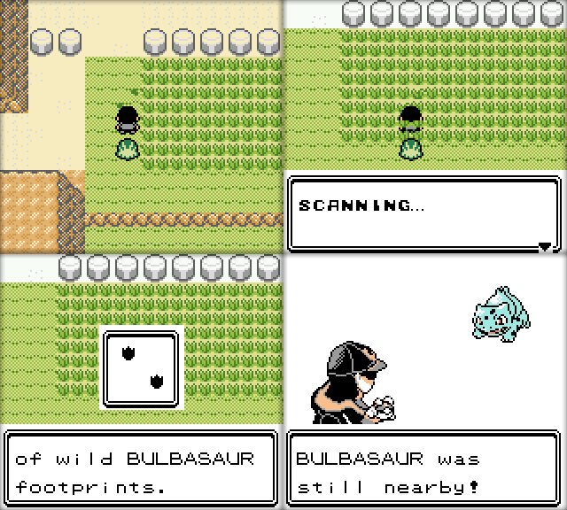

Keep an eye out for these, as they'll help you fill out your Dex by highlighting the rarer encounters in the area. Inspecting these will scan the species into your Dex, giving you seen data. But be careful - that species could still be nearby!

*You'll have to complete a small cutscene in Union Cave or Mt. Moon before this feature becomes available.*

I'd like to extend a special thanks to **Tiko** for the idea, **Grizz** for designing the rest of the missing Dex footprint graphics, and **Neph** for helping grind out all the data.

## Nickname Palettes

Ever since Gen 2 came out, shinies have long been the object of many a trainer's eye. But in the history of the series, there have been many other kinds of alternate colored species, from regional variants, to scientific mishaps, to unexplainable genetic anomalies. When **2.0 BETA** came out, we saw the first of these unique creatures present themselves in the **Elite Oink Squad** sidequest. While we still don't know the full nature of these wild beasts, we have learned more about how they've come to have such dazzling pigmentation. And now you can have your own species with stylish luminosity!

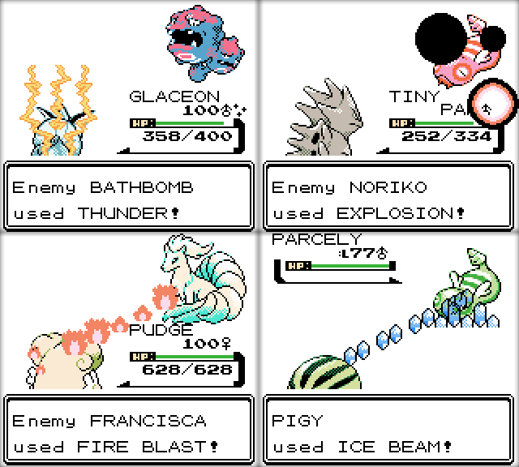

Introducing the _nickname palettes_ system! When certain species have the correct combination of DVs and nickname, they will load an alternate palette. This allows for alternate coloration without data modification, maintaining compatibility. These colors will be present everywhere that the palette is used, including link battles if both parties are on the same build of CC. You can even trade these species back and forth, and as long as they have the correct DVs and nickname, they'll stay that color when they return to CC!

Wondering what combinations you can use? Well, rumor has it that a _certain radio host_ is spreading relevant information on the airwaves. It might be worth investigating the Lavender Radio Tower as well.

If that's not enough, you can also define a single special palette per-save file. This can be set from the **RGB Tweaker** in the Dex, which is available by pressing START after entering the INFO tab. After making changes, you can press SELECT to save them, however:
 - only sets if you have that exact species, saving the first found species nickname, and DVs from your party.
 - sets for all evolutions of the species, so evolution is handled too.
 - has a mini-tutorial to it on first use, which can be reset by replaying the Dex tutorial.
 - Pressing START again discards changes.

## The Arena

Deep beneath Kanto's most prominent cities lurks a special breed of trainers. Those whose thirst for battle was left unquenched by what the surface has to offer. Those whose teams have been built to perfection. And those who wish to train for what is to come. They've found their home, deep down in...

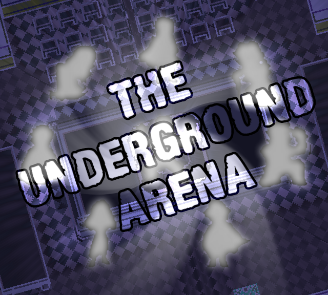

#### So, where is the Underground Arena?
 - The Underground Arena is an area accessible on **Mondays, Wednesdays,** and **Fridays** from the Kanto Underground. While this used to be two seperate maps, it's now been combined into one, with an entrance to the arena appearing in the center.

#### And who's down there?
 - There are over a hundred different trainers who can appear in the arena.
	* 70 of these trainers have returned from the Battle Tower!
 - Enemy parties are randomly generated based on the ruleset that you define
 - This includes using all additional moves, including egg moves, TMs, HMs, and the tutors.
	* (with a few exceptions like tournament banned moves, etc.)
 - Standard enemies have a 10% chance to use a special predefined party member.
 - These are the first trainers to feature Stat Exp, which is based on difficulty.

#### And how does this work exactly?
 - You choose the ruleset and your team is validated under that ruleset.
 - You aren't limited to certain levels - a SCALED option also exists.
 - You enter the ring, and battle until you are knocked out, or choose to forfeit (by selecting RUN.)
 - Every 5 battles:
	* Your party is healed
	* Your point modifier (points-per-battle) is increased by one
	* Your next opponent will be an Arena Boss, who will always have at least one predefined party member.
 - Pack items are not allowed and battle style is forced to SET (same as the E4 Rules)
 - During arena matches, the "AI randomly misses" clauses have been lifted.
 - All trainers regardless of class use the best possible AI settings.

#### And what are the rewards?
 - These trainers won't give you money, but instead you can earn points based on your ruleset.
 - Points can be cashed in for items, several of which are new and can't be found anywhere else!
 - Only SCALED battles give regular Exp, but all formats give Stat Exp.
 - Winning 100 battles in a row will give you 10x your current point modifier.
	* This will also unlock forcing music while in the arena

Keep an eye on the crowd, as many trainers from around the world come to spectate these battles. You might see someone you know!

## Mirror Matches

There's one other unique battler visiting the Underground Arena, and what she brings to the scene reflects her abilities quite well. **Lass Duplica,** also known as **Copycat,** is offering Mirror Matches to those who seek to conquer themselves.

# New Maps and Overworld changes

This update has a small handful of new maps, and plenty of expansion to further refine the overworld. The biggest attraction outside of the aforementioned Underground Arena, is the **Goldenrod Cafe!** Found in Goldenrod City, this area features a rotating set of cafe patrons throughout the week, a new cutscene, and some new features, all of which is outlined below.

Also, due to public demand, the **Ace Trainer HQ** is now accessible. However, it is under construction, so watch where you step!

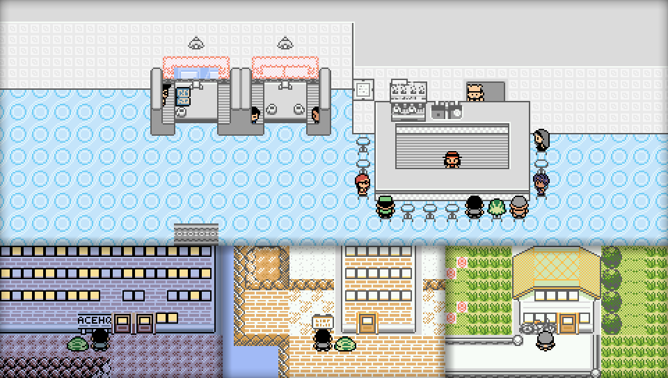

## New Areas:
 - Goldenrod Cafe
	* Features a meal system, food that's available 3 times a day - morning, day and night.
	* Meals apply to the follower/first-alive party member, and will heal, apply a stat exp buff, and increase happiness.
	* Leftovers are also available for purchase once a day
	* A different set of NPCs will be available every day, including Engineer Kensworth, Ex-Rocket Zevach, Ace Trainer Cat and Diviner Ryan, who won't be in their respective spots on these days.
	* Some of these NPCs will have one time events, so keep an eye out!
	* After battling Doom in National Park, he'll always visit the Cafe afterwards.
	* There's a small sidequest available by talking to the Cafe's sign outside.
 - Kensworth's House (Goldenrod)
	* Kensworth is there on Saturday and Sunday
	* Offers a Diglett/Magnemite trade (replacing the missing Dugtrio/Magneton trade with a more early-game focused one)
 - Ace Trainer HQ (Route 3, Mt. Moon exit)
 - Route 16 Biker Bar
 - Route 21 Lighthouse
 
## Expansion:
 - Combined the Name Rater and Move Deleter maps into one map called the **Modification Station**, which is now accessible from:
	* Goldenrod City
	* Blackthorn City
	* Lavender Town
	* Fuchsia City (new!)
 - Grullo Gorge now has an upper mountain area preserve, accessible from inside the caves.
 - Expanded Routes 15, 16, 17, 18, 20, 21, and New Cinnabar Island
 - Many places that connect to the new residences received minor changes.
 - Cerulean City now has grass(and unique wild data to match), and the mountains of Route 24 now connect to it
 - Combined the two Kanto Underground Maps into one large Underground
 - Added pass-through maps for the Route 7 and 8 Underground Path buildings

## Misc Tweaks: 
 - Cerulean City, Grullo Gorge, Routes 5, 9, 11, and 10 (South) are now aligned properly
 - Routes 3, 8, 12, 14, 15, Grullo Gorge, and Pewter City have been tweaked to better match the Town Map
 - Updated the Kanto Town Map to better reflect the overworld
 - Olivine Lighthouse now has an upper outcropping, with special guard rails.
 - Minor changes to Goldenrod signs
 - Added an extra staircase on Route 3
 - Moved Cinnabar Island Fisher over to the water
 - Great Ball overworld sprite on Route 32 became a hidden item
 - Minor tweaks to Blackthorn Silver Cave
 - Added some more grass to Route 4
 - Moved "Just taken your first steps into Kanto!" guy from Route 27 to inside the nearby house
 - Moved Red over one tile to match the other Mt. Silver champions.
 - Changed Route 8 Underground building to match the other three
 - Shifted some NPCs around in Goldenrod City
 - Removed a boulder and added a shortcut ledge to Route 10 North (jumping down after getting up to Zapdos)
 

# Gameplay changes

## New events

 - Replaced cut tree between Route 32 and Cherrygrove Bay with a scaling stationary Sudowoodo
	* Talking to, or using the SQUIRTBOTTLE on this one works backwards!
  
 - Replaced Bill's Garden Porygon with "Pikablu"
	* Still knows FLASH, but now also gets SURF!

 - Added 3 scaling Aerodactyl to the top of Grullo Gorge
	* Same shiny odds as the fossil Aerodactyl, and will play overworld shiny animation before battle
	* Always know FLY and ROCK SMASH as moves
	* Respawn every time the map is entered

 - Added an event in New Bark Town where the player can steal an egg from Elm's window sill, Silver style.
	* This is mostly to fix Togepi being the only species in the game unobtainable until after 1 badge unless chosen as a starter.
	* Always knows THIEF. The normal acquisition method now comes with HEAL BELL.
	* Try talking to ELM after.

 - Added a togglable waterfall to Cherrygrove Bay Forge
	* Works just like a normal waterfall.

 - Added a small lost pig event in Blackthorn City
	* Designed to hint at the hidden ledge going to Mt. Rose
	* Try triggering this one from different angles!
  
 - When Doom is fought in National Park, this triggers an event in Goldenrod Cafe
  
 - Azalea Town Gym Roof Slowpoke can be talked to from the closest sides of the gym
 
 - The stranded Cooltrainer outside Cinnabar Tunnel now surfs you across the water if you don't have surf

 - Added a Bug Catcher in Cherrygrove City to hint at the Forest Path.

 - MooMoo can now be healed by a GOLD BERRY for 3 berries, BERRY JUICE for 5, and a MIRACLEBERRY for 7
	* also has a sick palette and some extra animations

 - There's a new secret ledge hidden deep in a cave, hinted only by footprints.
	* the hidden item found there will also work for some overworld events

 - After defeating the Mt. Silver champ, the player is informed of the final forge battle via a one-time event, if the forge battle hasn't been completed already.

 - Added the remaining/missing overworld TMs. Each TM should now be available somewhere in the overworld.

## New and updated trades
NPC Trades have received a decent bit of reworks, to be more useful options earlier in the game, and have better DVs and held items. **7 additional new trades** have also been added across the overworld, including the one that went missing after the Power Plant was reworked.

**Trade Locations:**
 - Goldenrod Dept.Store 5F
	 * (ABRA for MACHOP)
 - Violet City (House)
	 * (BELLSPROUT for ONIX)
 - Olivine City (House)
	 * (EEVEE for SQUIRTLE)
 - Blackthorn City (House)
	 * (BUTTERFREE for DODUO)
 - Pewter Center 1F
	 * (GASTLY for NATU)
 - Route 14
	 * (SNUBBULL for MISDREAVUS)
 - Goldenrod City (House)
	 * (DIGLETT for MAGNEMITE)
 - Route 43 Mahogany Gate
	 * (Anything for SWINUB)
 - Route 10 Center 1F
	 * (SLOWPOKE for TEDDIURSA)
 - Ace Trainer HQ
	 * (WOOPER for WOBBUFFET)
 - Route 16 (House)
	 * (LEDYBA for SMOOCHUM)
 - Vermilion Port Passage
	 * (KRABBY for STARYU)
 - Cinnabar Tunnel
	 * (BEEDRILL for LICKITUNG)
 - Elm's Lab
	 * (UNOWN for GIRAFARIG)

## New trainers/data changes

 - Added Johto and Kanto Moms!
	* Can be fought after defeating the E4 or if your current residence is their respective houses
	* Defeating a mom sets the Mt. Silver champion to match that region until clearing the E4 or the Mt. Silver champ.
	* Updated both OW mom sprites to reflect trainer sprite designs more accurately
	* Can be refought after clearing the E4 or the Mt. Silver champ.

 - Mt. Silver champions now have held items, improved AI, and more diverse movesets including some Battle Tutor moves.

 - Gold now has a Sudowoodo instead of a Togetic.

 - Changed Cat's base reward from 25 to 40

 - The following trainers got set updates:
	* Acetrainer Cat
	* Researcher Grizz
	* Engineer Kensworth (now yields additional items after rechallenging)
	* Ex-Rocket Zevach
	* Realter Neph
	* DJ Fef
	* Kid Muddy
	* Lass Tiffany
	* Scientist Justin

# Quality of Life Updates

 - Removed random Daycare text

 - Scrolling tutors now display Left and Right arrows.

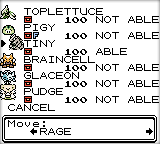

 - Exiting the mart menu in the TM marts now returns to the set menu, instead of exiting the script

 - Any time the party is healed, each party member's stats are updated.
	* This means you don't have to deposit and withdraw level 100 party members to update stats correctly

 - Soft-reset is disabled when a shiny is initially found on the nickname screen or in battle.
	* Note that this won't stop you from exiting or advancing text, which re-enables the ability to soft-reset.

 - When a shiny is found in battle, an "Oh, it's a shiny!" message will display. This includes Quick Encounter, to put an extra A button press between re-enabling soft resetting.

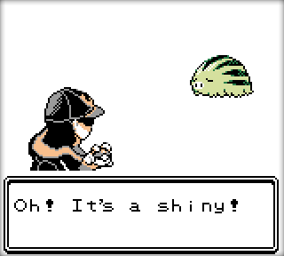

 - Press SELECT to honk the train horn :)

 - Minor reorganization of map setup scripts and and double speed is now enabled during the disabled-LCD phase (should speed up non-connection load times)

 - Double speed is now active sooner in the intro sequence

 - Cut trees now stay cut!

 - Using the Squirtbottle on Route 34 can restore the grass tiles

 - The PCs in Gold and Red's house now work normally, so if you're not living there, the PC can still be used(since these towns didn't have that option in the labs.)

 - Reduced the price of buying a PP UP in the Game corner to 2400

 - Coin Prize Vendors now correctly wait for a prompt before entering the menu.

 - Seen data is now properly set when talking to matching overworld species

 - Hidden Power is now a Set 1 TM

 - A new NPC has been added to the combination Name Rater/Move Deleter house, called the **Nature Tweaker**
	* For use with Transporter, which decides Nature based on current experience points
	* Can determine a party member's current Nature
	* Can tweak individual party member Natures, or apply a Nature to all of box 1!

 - The Legality Fixer has received some much needed updates and new features:
	* You can choose to scan a party member for potentially illegal moves
	* Ignore Kanto TMs that are also learned via level-up
	* Remind the player if the party member has a held item
	* Displays a level suggestion if the party member's level is too low
	* Includes exceptions for event/battle tutor moves that became TMs/HMs
	* Fixing OTIDs has a new animation

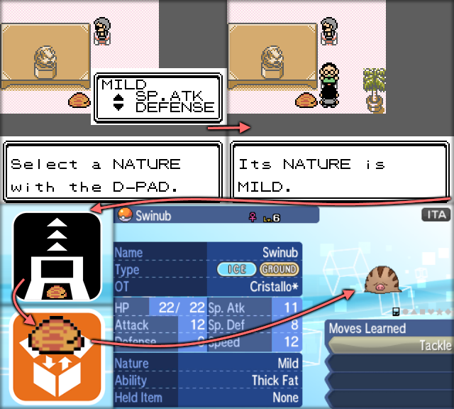

 - Streamlined updating from older versions: 
	 1. Save inside the Olivine Center
	 2. Swap builds
	 3. Exit the map 
	 4. Talk to the Center sign on the outside of the building.
	 * The Nurse method will still work, but this is just easier for updating from older builds.
	 
 - Stadium 2 no longer requires beating the in-game E4 to unlock the additional GB Tower modes.

 - Substitute now has a new, faster animation.
	 * It also now uses species-specific sprites!

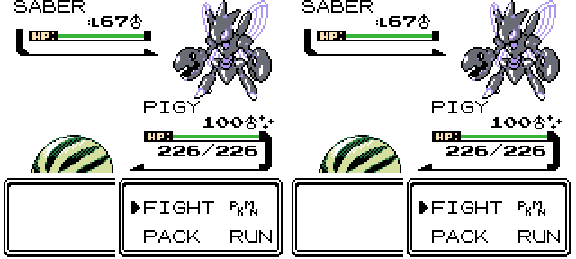

# Wild Data Changes

Wild data received a _lot_ of changes. This was mostly for consolidation to make parsing with the Dex a little bit easier, but a few systems got total reworks. A lot of minor tweaks happened all at once, so the best way to find out what's available where is to use the Dex. However, some changes will still be listed below.

### Walking:
 - Cleffa is now a 1% walking encounter in Mt. Moon.
 
 - Added Gloom to Forest of Rage

 - Added Bellsprout to Sprout Tower

 - Added a lot more new species to Tin Tower

 - Tweaked wild data for Union Cave

 - Tweaked wild data in Mt. Mortar, Rock Tunnel, and Route 10 North

 - Lowered Whirl Islands NW levels, upped Squirtle encounter rate

 - Added Dunsparce to the side of Dark Cave it was missing from.

### Bug Catching Contest:
 - Now includes every single Bug type in the game, including all evolutions.
 - Levels better match each species (no more level 18 Caterpies)
 - NPC entrants have updated data to match.

### Fishing:
 - Data restructured everywhere, allowing for more entries per-rod
 - Cleaned up redundant "Time of day" entries and pointless extra data
 - Combined similar tables leftover from vanilla
 - Base levels are more diverse, and each encounter can have its level raised up to 4 (similar to how surfing works.)
 - Cleaned up map headers with unused fishing data - this affected most maps.
 - Added a new Grimer fishgroup (used in Celadon City)

 - Fuchsia City now has Seafoam Islands fishing data

 - Fixed Route 4 and Cerulean City not having local fishing data

### Headbutt:
 - There are no longer two seperate tables for "good" and "bad" trees - the data has been consolidated to one table per group.
 - This also means that headbutting a tree will always have a constant encounter rate.
 - Base levels are more diverse, and each encounter can have its level raised up to 4 (similar to how surfing works.)

### Rock Smash:
 - Encounter rate when smashing a rock is now doubled. (effectively the same as headbutt trees)
 - Base levels are more diverse, and each encounter can have its level raised up to 4 (similar to how surfing works.)
 - Species are now greatly diverse, as rock smash has been split into 6 different groups:
	* These rocks have different palettes in the overworld to indicate what group they belong to.
	* Beaches, Mountains, Caves, Ice Path, Heat rocks, Moon rocks.
	* Shuckle is present in all groups.

 - Added more smashable rocks to Cinnabar Island, Cinnabar Mansion, New Cinnabar Island

 - Added 3 extra rocks and Rock Smash TM to Cinnabar Tunnel and Slowpoke Well

 - Added 3 mountain rocks to Grullo Gorge

 - Fixed Mt. Moon rocks not having encounter data.

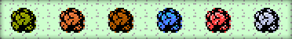

### Misc:
 - Removed Swarms.

# Tutor Updates

*Hey, it’s Grizz! This update affects the Battle Tutor as well! I did some thinking and Shock did some thinking and we thought up the idea to give out some great new utility moves to EVERYBODY! 130 species now have access to False Swipe that didn’t before, as well as 29 species having access to Teleport (which has a lot more usefulness in this update)! We also added a bunch of new moves to reflect new Galarian formes of classics like Ponyta, Slowpoke and Farfetch’d! There have been other additions too, but it’s up to you to discover them! This should make your Crystal Clear adventures at least 300% more fun! Or else!*

*We also removed access to Egg Moves in order to boost the usefulness of our two new tutors: the Egg Tutor and the Future Tutor! If you need Egg Moves don’t bother me, bother them instead! Also, the most important addition was giving the pigs the ability to go HOG WILD! You’ll see what I mean. Now get out there and have some fun!*

### New tutors:
Added the **EGG MOVE TUTOR** and the **FUTURE MOVE TUTOR** in Vermilion City:
 - Unlike the other tutors, these have a cost of a GOLD or SILVER LEAF.
 - Works like the Move Reminder screen, but with a few QoL improvements. 
 - Future Move Tutor teaches any level-up move, regardless of level.
 - Can also teach earlier level up moves, but will still cost a leaf unlike the Move Reminder

### TM updates:
 - Natu/Xatu can now learn Steel Wing
 - Onix can now learn Rollout

### Fixes:
 - Fixed missing Mimic entry for Wobbuffet via Event tutor
 - Fixed Politoed not getting Rock Slide via Kanto TM tutor

# Follower Changes

There's always something.

### Tweaks
 - Grass types now enjoy the SQUIRTBOTTLE!
 - Expanded the held-item interaction to cover more food-based items	
 - Added handling to the tile-based interaction script for the lava in the New Cinnabar Gym
 - Simultaneous pitfalling with a follower will now result in a simultaneous landing too. 
 - Movement engine received a handful of tweaks to limit when animations are playing and follower is idly stepping 
 - Entering the overworld from continue will now validate the current follower choice, and remove it if it shouldn't exist
	 * Fixes ghost followers when removing party members using Stadium 2, and likely also save editors as well.

### Fixes
 - Changed "eying" to "eyeing" in cave map text 
 - Fixed text formatting for one of Muk's species text entries.
 - Fixed BUENA'S PASSWORD animation not restoring follower idle animation
 - Fixed follower shiny animation not restoring idle animation
 - Fixed SACRED ASH not respawning follower
 - Fixed switching party members not remembering which follower is surfing
 - Fixed SQUIRTBOTTLE script not jumping to check follower movement data correctly
 - Fixed external party reduction creating ghost followers
 - Fixed evolution not updating object attributes correctly after wild battles.
 - Added grass flag checking to updating object attributes, fixing inconsistencies.
	* For example, Abra hovering over grass evolving into Kadabra walking in the grass. 

# Visual changes

### Features:
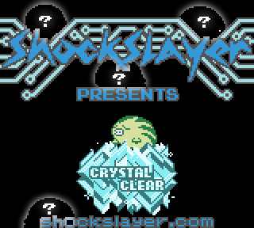
 - The different Elite Oink Squad members now appear on the title screen after you've met them.
	* Each member is also updated after the post-251 forge battle!
 - Original GSC species palettes can now be toggled on/off in the Dex.
 - Priority tiles above the player are now disabled before teleporting or flying.
	* This is demonstrated best around the Olivine Lighthouse outcropping.
 - Poison palettes are now only applied to the first palette in each row, and vary based on time of day. The result is a much softer animation.
 - Added a sliding animation to the "new area" sign.
 - Surfing Pikachu now has some extra handling to use the player's exact Pikachu palette
 - Unown no longer flips on the X axis - this means letters will always face the correct way	
 - Hovermons now hover more smoothly
 - The Mewtwo cutscene battle now has hardcoded DVs - this doesn't affect the actual encounter, just prevents the cutscene from mistakenly showing a shiny that wouldn't carry over later.
	* It also uses a custom darkened palette in battle, so that resetting for shininess makes more sense canonically.
 - Azalea Town and E4 Room 4 now use the follower Slowpoke sprite
 - Sword/Fishing extrusion sprites now flip on the Y axis
	* This means the Sword can have a point instead of being a flat line!
 - Added an angry emote. >:(

### Pixel tweaks:
 - Diviner Ryan got a full set of design updates
 - Updated both male and female Swimmer overworld sprites to look more like their frontpics
 - Updated Grimer's OW sprite
 - Fixed Espeon's icon frames being backwards.
 - Tweaked Tyranitar's OW sprite's tail
 - Minor pixel fixes for:
	* Lake of Rage Gyarados Sprite
	* OW Haunter
	* OW Gligar
 - Updated Doom's OW sprite
 - Minor tweaks to Pinsir's icon	

### Color tweaks:
 - A lot of the randomized overworld NPC palettes introduced in the last update have been manually touched up. 
	 * Many color values have also been tweaked
	 * Some NPCs have been changed due to palette limitations or for the sake of consistency 
	 * (For example, correctly matching palettes between Bug Catching Contest Contestants and the maps they appear on.)

 - Emotes now have colors
 - Fixed Politoed's shiny palette
 - Fixed intro Pigy's palette
 - Fixed Earl's palettes not matching
 - Aerodactyl, Unown, Delibird, Dratini, Dragonair, and Corsola are now all AltColorMons
	* This means that one of their OW sprite colors will be hard-coded to be a specific color, like white or tan.
 - Tweaked Beedril and Skarmory's shiny palettes
 - Modified Bug Catching Contestants overworld palettes to all match
	* This means that their matching overworld trainer, contest object, and park gate object now all use the same colors.
	* Some trainers had to double up in order to fit the palette limit
 - Grizz's Lab's Dunsparce now match his nickname palettes
 - Some strength boulders now reflect the local rock smash palettes.
 - Minor tweak to Cooltrainer Gio's palette
 - Cherrygrove Bay House now uses the Wii palette
 - E4 Room 3 now uses the correct palettes for each console.
	
## GBC Colors

If you've ever tried playing CC on a backlit GBA, you've probably noticed that the colors are very sharp, to the point where they look overly saturated. Unfortunately though, there's very little that can be done in a lot of specific hardware or even emulator situations like this to adjust color to be easier on the eyes. As a result, I've come up with a bit of a shortcut around that.

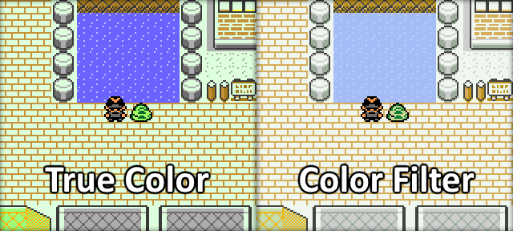

As of 2.1.0, CC now has a second set of patches; the only difference is that these have a color filter applied directly to the color data. This filter is an approximation of BGB's "GBC colors" filter. However, it's not a perfect replica, especially since color values have to be rounded up or down, and should be considered experimental. However, initial feedback was very positive, so I hope you enjoy it!

# Misc Changes

#### E4 Reset now also resets:
 - Kiyo's Tyrogue
 - Magikarp Salesman
 - Mania's Shuckie
 - Togepi Egg
 - Shiny Ditto Egg
 - Odd Egg
 - Gold Magikarp/Red Gyarados 
 - Cherrygrove Bay Sudowoodo
 - Lapras (optional early reset to avoid clock reset)

#### Other changes

 - Red Gyarados script will only give another RED SCALE if they player doesn't have one.

 - Tweaked SACRED ASH sound effects to fit better
	
 - Wild data is now turned off temporarily during the scripted Burned Tower events.
	
 - 16 badge League call will now play a victory theme and acknowledge the player as a master.

 - Using a doll on Pigy will:
	* play a heart animation and successfully end the battle(will consume) during the E4 encounter
	* play a question animation and fails(won't consume) during the final Pigy encounter.
	
 - Celebi and The Champ now prevent the use of dolls.

 - Frank now disappears after the second battle

 - Swapped out Leftovers for Brightpowder in the Kanto Game Corner prizeroom.
 
 - Removed Brightpowder from Azalea Mart

 - Can no longer fish on NPCs

 - Remove unused credits code and music
 
 - Removed credits after Mt. Silver champ

# Text Changes

 - Added references to Ralph's and Arnie's text about better places to catch the old swarm species.
 - Changed some text formatting in the Safari Zone Main Office
 - Updated GBC Only screen text and moved it earlier in the boot sequence to get around quick continue errors
 - Replace second intro screen with scam warning and latest update notification
 - Added extra SFX and message to clarify that the PICKAXE is returned.
 - Tweaked Cat's dialogue to reflect the Dex update
 - Changed RANDY's mail to provide a hint towards Dark Cave Grizz
 - Tweaked RANDY and the Route 31 guy's text to reflect keeping KENYA
 - Tweaked Grizz's Dark Cave text
 - Added some text to Cinnabar Tunnel Fibbef to reference the new dex.
 - Added a little extra dialogue to Noak's explanation
 - Updated Neph's text to reference his new occupation as a real estate developer.
 - Removed species/move specific text references in Mt. Mortar
 - Changed "HOME" to "START" in reference to the LAST FLOWN option
 - Fixed outdated "fifth badge" reference
 - Added a reference to the ledge behind Cedsi in Rob's Route 28 text.
 - Rewrote text in Mahogany Town house to reflect the Forest of Rage
 - Fixed Fast Ship badge text reference
 - Fixed outdated Route 19 Gate information
 - Rewrote outdated Route 38 Ecruteak Gate text
 - Rewrote Route 41 Swimmer Berke's text to reference Amphy and the Silver Wing
 - Updated Technology Man in Pallet town to reflect the one-year timeskip.
 - Updated Rob's Route 10 North data and text to reflect the new changes.
 - Tweaked MooMoo's script text to be more generic since items are now different.
 - Fixed two Gym guides using incorrect opening phrasing
 - Minor text change in Violet Onix Trade House
 - Fixed Bluebell using "it's" instead of "its"
 - Tweaked bag text in National Park

# New Music

I'd like to extend a couple special thanks; **Kensworth** for sitting down with me and helping optimize over 45 tracks to use less space in-game, and **ShinkoNetCavy** for doing an _awesome_ cover of the Gen 8 Gym battle theme. This track is the first ever to use the new "Variable Battle Music" system, which will alter the music based on the player's advantage/neutral/disadvantage/final state, just like the games it hails from!

A few tracks also received some minor fixes and updates.

### Music additions

[Megalovania](https://soundcloud.com/user-927422935-571023782/undertale-megalovania-ssbu8-bit)

[Determined Eyes](https://soundcloud.com/user-927422935-571023782/mega-man-zx-advent-determined-eyes-double-megamerge-8-bit)

[X4 Char Select](https://soundcloud.com/user-927422935-571023782/mmx4-character-select-8-bit)

[Rainy Turtloid](https://soundcloud.com/user-927422935-571023782/mmx6-rainy-turtloid-8-bit)

[MMZ Clear Stage](https://soundcloud.com/user-927422935-571023782/mmz-clear-stage-8-bit)

[Gen 8 Gym Leader theme](https://soundcloud.com/user-927422935-571023782/swsh-gym-leader-theme-8-bit-by-shinkonetcavy)

[Divine Bloodlines](https://soundcloud.com/user-927422935-571023782/castlevania-divine-bloodlines-8-bit)

[Stadium 2 Anthem Remix](https://soundcloud.com/user-927422935-571023782/pokemon-stadium-2-anthem-remix-8-bit)

[Combustion](https://soundcloud.com/user-927422935-571023782/mega-man-zero-3-combustion-8-bit)

[LoZ:TP Hidden Skill Training](https://soundcloud.com/user-927422935-571023782/loztp-hidden-skill-training-8-bit)

[Where the hood at?](https://soundcloud.com/user-927422935-571023782/dmx-where-the-hood-at-8-bit)

[Power Bom](https://soundcloud.com/user-927422935-571023782/mega-man-zero-2-power-bom-8-bit)

[Electric Zoo](https://soundcloud.com/user-927422935-571023782/electric-zoo-8-bit)

[Grand Prix](https://soundcloud.com/user-927422935-571023782/mmbn3-n1-grand-prix-8-bit)

[Great Battlers](https://soundcloud.com/user-927422935-571023782/mmbn3-great-battlers-8-bit)

[LoZ:LA Overworld](https://soundcloud.com/user-927422935-571023782/loz-la-overworld-8-bit)

[Rocket Jump Waltz](https://soundcloud.com/user-927422935-571023782/tf2-rocket-jump-waltz-8-bit)

 - Rocket Overture was readded to Sound of Pig

 - Kensworth's battle now unlocks Ronald's theme manually

 - Removed Teehee Valley and Macho Man from some music tables

# Bugfixes

 - Tons of compression, space-based optimizations, and code cleanup
 - Fixed missing checkevent in Tin Tower 1F
 - Fixed rework oversights in Mania's script
 - Wise Trio's room sets the clear bell's extra event if it's somehow missed beforehand
 - Fixed a bug where putting the fossils into the PC would allow them to be reset with the E4
 - Fixed talking to Doom from behind screwing up the priority tiles
 - Added "You blew it." handling for losing to the catchable PIGY at the very end
 - Fixed Mr. Fuji talking to you about Mew before it's released (but only if a traded or injected Mew sets the caught data)
 - Fixed doublespeed persisting through intro sequence
 - Corrected Route 36 and Ruins of Alph building textures and tiles
 - Minor, but overall incomplete fixes to pitchbend
 - Fixed goofy gfx in starter select
 - Added weird hRandomAdd modification after walking encounter - might fix the "limited DV spread" and untraceable reports of certain songs being more likely to play than others
 - Fixed Main Menu applying forced music when it's not supposed to
 - Fixed a bug with the music menu not properly restarting the map music when surfing and using forced radio
 - Fixed the Dex rating system incorrectly parsing an extra box of nonexistant data
 - Fixed Buena's password radio text being one line too high
 - Viridian Forest and the Safari Zone now have proper grass cutting handling
 - Fixed two "forsaw" typos to "foresaw"
 - Switching two identical key items no longer corrupts the bag
 - Ported save validation code
 - Fixed shared signpost script calling between National Park Gates
 - Fixed Grizz saying who's instead of whose
 - Fixed Overworld Radios station names having extra spaces
 - Fixed having a palette of 00 triggering Nurse Joy script
 - Fixed Cherrygrove Bay Journal player name overflowing out of the box
 - Fixed missing Forest of Rage tree tiles
 - Fixed missing comma in Fibbef's Route 7 text
 - Fixed Cat saying "heard" instead of "I heard", and capitalized MOUNTAIN AREA
 - Fixed Safari Zone Gate not using the correct handling for checking money (wouldn't take exactly $500)
 - Fixed Tin Tower event not handling music properly after the cutscene
 - Fixed Tin Tower removing forced music when entering the tower at any time
 - Fixed LITE DVs being subject to battle animation palette rotation - now share the HP bar's palette (this was only present in the Hidden Power animation)
 - Fixed pushing the boulder in Burned Tower B1F turing its palette white
 - A specific radio ditty is no longer forcible as music
 - Master ball is now worthless when sold
 - Route 25 Nugget Brigade leader sets an event when giving the nugget, which is only cleared when restarting the challenge (fixes a nugget spamming loop when not beaten)
 - Fixed extra waitbutton in Route 36 Rock Smash TM script
 - Fixed Red's House TV text assuming the player is from Johto
 - Fixed Luster Ball showing the old Unown form as shiny
 - Fixed Coin converter displaying incorrect values when purchasing certain amounts of coins
 - Fixed Coin converter's display to update smoothly(no more flickering text while scrolling)
 - Fixed mis-ordered HMs (weird backend thing from vanilla that reflected in the new dex)
 - Alphabetized egg move entries (another weird backend thing, but reflects in the new dex)
 - Fixed the order of Muk's moves (another weird backend thing, but reflects in the new dex)
 - Added missing clearevents to Mt. Rose's rocks
 - Fixed incorrect number of items in the common pickup item table
 - Fixed Tin Tower 9F not handling music reset properly
 - Fixed Bill's box changing script not handling previous/lack of save files
 - Frank's script won't save the game if there's no pre-existing save file(fixes same bug as was present in Bill's script)
 - Fixed Mewtwo cutscene not resetting music properly
 - Removed unused surfing data from Route 9
 - Fixed the "Battle Tower Ruins" not appearing as a landmark properly
 - Fixed rechallenge warping to the non-standard door entryway for Blackthorn and New Cinnabar Gyms
 - Fixed MooMoo script not temporarily disabling forced music for healing music
 - Fixed Fuchsia City Zoo "the the"
 - Fixed a vanilla Crystal bug with deleting a phone number copying an extra byte into the list
 - Fixed an infinite loop softlock when injecting Unown
 - Added (most of) the remaining missing characters to the injector
 - Blank injected player names now default to CHRIS if naming is skipped.
 - Fixed Natu and Teddiursa's species names having an extra space. IE "LITTLE BIRD" becomes "LITTLEBIRD" because of text space limitations in the new dex caught screen.
 - Fixed someone else's buggy loss text code not working when none of the high and low bits of the stored address matched
 - Fixed Region Map not being depositable
 - Fixed entering New Cinnabar mart using the wrong warp
 - Fixed logging out of Bill's PC multiple times after saving not keeping proper track of the follower
 - Fixed tradeback guy not using the correct OT when sending the mon back
 - Fixed the Cycling road gate scripts not working correctly when approached from the left
 - Fixed Celadon Game Corner Gramps not turning back correctly
 - Fixed Frank's easter egg switching the box when saving
 - Fixed Dratini and Dragonair not learning Whirlpool from the Battle Tutor
 - Fixed Sentret not learning Whirlpool and Waterfall from the Battle Tutor
 - Fixed a bug where disabling music would not work correctly when riding the train
 - Fixed Camper Todd not allowing you to re-register his number when a rooftop sale is going on.
 - Fixed updating from older versions potentially triggering the nurse script more than once.