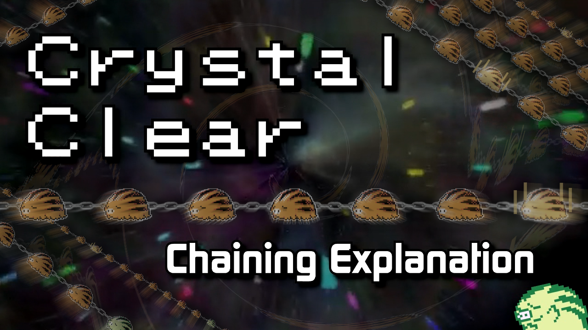
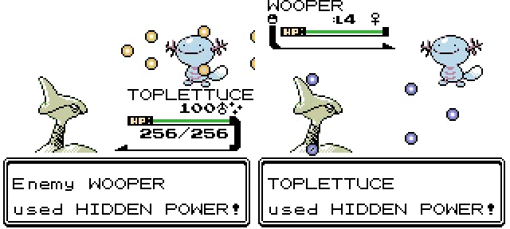

2.2.0
--------------

*Please note that this changelog will have some spoilers for legendary events in it, so proceed with caution.*

## Credits:

**Muddy** - Hidden Power nickname palettes

**Cedsi** - Detailed analysis of chaining math

And a special thanks to everyone who reported bugs in the Discord server!

## Introduction:
This update isn't nearly as big as the last one, but hopefully the new features and areas make a positive impact on the game. If you've been paying attention in the server, you'll probably notice that community feedback was relatively important in deciding what got done this time around.

## Gameplay Changes:

#### Chaining:
Added a new key item, the **DEX TRACKER** which is used to keep track of the new chaining feature:

[(Youtube Video)](https://www.youtube.com/watch?v=femz1MF5ra8 "Chaining")

(For a text explanation, see this new section of the documentation: [Chaining](https://github.com/ShockSlayer/ccdocs/blob/master/docs/Documentation.md#chaining))

 - The DEX TRACKER can be upgraded to support searching for Hidden Power type by obtaining the **UPGRADE CARD** in the second room in New Cinnabar Lab
 
 - Safari Zone now gives two extra rerolls instead of just one

 - National Park (including the Bug Catching Contest) now applies the same bonus as the Safari Zone

 - Footprints can now start chains
	 * This will start the chain at 25, making it easier to find the footprint species. 

#### Pseudo Abilities:

Added 3 more **"Pseudo Abilities"** - basically bonuses applied when certain species are present in the party. These have no effect on battling. Pseudo Abilities were given to the species that they would be found on in later gens, and several additional species have been included in order to make these more available.

 - **Suction Cups/Sticky Hold:** increases finding a fish chance from 50% to 80% when in the **first** party slot, even while fainted
	 * Found on: Grimer, Muk, Octillery
	 * New to CC: Bellsprout, Weepinbell, Victreebel, Mr. Mime, Tangela, Ditto, Omanyte, Omastar, Teddiursa, Shuckle, Aipom, Politoed

 - **Compound Eyes/Super Luck:** increases wild species held item chance from 25%/8% to 70%/20% when in the **first** party slot, even while fainted
	 * Found on: Butterfree, Venonat, Yanma, Togepi, Togetic, Murkrow
	 * New to CC: Venomoth, Paras, Parasect, Spinarak, Ariados, Ledyba, Ledian

 - **Flame Body/Magma Armor:** increases happiness point steps from 1 to 2 while hatching eggs when in any slot in the party. This effectively halves the time to hatch.
	 * Found on: Ponyta, Rapidash, Magmar, Moltres, Slugma, Magcargo, Magby
	 * New to CC: Chansey, Blissey

These lists can also be found in game, in Saffron City (see below.)

#### Nickname Palettes:
Thanks to the efforts of everyone's favorite wild(?) Wooper listening to distant ribbits, we now have **40** additional nickname palettes - each of which represents a specific hidden power. These were designed with a competitive edge in mind, and should play nicely with the **UPGRADE CARD.**

The papers on the desk in the Lavender Radio Tower will list the Hidden Power type of the current nickname palette.

#### QoL Additions:
 - Fishing now prompts the player to "Keep fishing?" after succeeding or failing to find an encounter.

## Map Changes:

Following the completion of the chaining feature, it occured to me that it would be lame if certain species couldn't be chained. While _technically_ this is still true for certain evolutions, many people will be happy to know that I've spent some extra time knocking out some additional maps and events in order to make it possible to chain every species. This includes species that were previously event only, as well as the roaming legendaries, who now have unlockable stationary encounters.

#### Additions:

 - Added **Mount Mortar Peaks**
	 * Connects to Route 42, Route 43, Mt. Mortar, and Tin Tower 2F
	 * Fully fleshed out wild data, including mountain rock smash rocks and visible/hidden items
	 * Features overworld Togepi that only appear when the follower or first party member has at least 100 happiness
	 * Has its own landmark

 - Added **Mirage Sanctuary**
	 * Mew is available as a stationary here after defeating it and resetting via E4, or by meditiating with Eusine.

 - Added **Power Plant Basement**
	 * Raikou is available as a stationary here after defeating it and resetting via E4, or by feeding Amphy a Berry.
	 
 - Added **Ruins of Alph Entei Chamber**
 	 * Entei is available as a stationary here after defeating it and resetting via E4, or by finding the lost girl on the Fast Ship.

 - Added **Silph Co 2F**
	 * A new floor that is under construction, currently housing experimental equipment...
	 * Features a small cutscene that spawns several overworld Porygon
	 * Requires stealing a "Visitor's Pass" from the residence in Bill's House and tricking the guard into letting you in.

 - Added the **Saffron City Abilities House**
 	 * Inside are several books that list the species who have pseudo abilities, as well as what the abilities do.
 	 * There is also an NPC who will explain what possible wild held items might be found from the last viewed species in the dex.

#### Expansions/Changes:

 - Expanded **Silph Co 1F**
	 * New design is a mix of other generations and has the big fountain again. (Try inspecting it from the center!)

 - Expanded **Ice Path B3F**
	 * Added an additional rock to smash
	 * Added fishing and surfing wild data
	 * Added several overworld Piloswine encounters (scaling, but always starts at Lv30)

 - Widened **Ruins of Alph Outside** by 4 blocks to add the Entei Chamber

 - Added a gate to **Tin Tower 2F** for entering from Mount Mortar Peaks, including a gate animation

 - Added a secret entrance to **Sprout Tower 3F** from Violet City
	 * Perhaps bring a follower that knows Thief?

 - Added a staircase to the **Power Plant** for the basement

## Tweaks:

#### Legendaries:
 - Ho-Oh and Lugia now scale with badges, and always have Fly and their signature move.
 - Legendary cries now have an added earthquake effect and instant text. 
 - Stationary roamers have different movesets than their roaming variants
 - Added follower recent event text for the stationary Entei and Raikou

#### Battle Tutor:
 - Added Waterfall to Tentacool and Tentacruel
 - Added Substitute to Swinub and Piloswine
 - Added Confuse Ray, Glare and Thunder Wave to Murkrow

#### Wild Held Items:
After releasing the last update, there was some confusion about how to get things like the Gold and Silver leaves. Honestly, I thought they were available as wild encounter held items. But this turned out to be only when traded from Gen 1, which is cumbersome at best. So, I've spread them out to the same species that they would be found on, and added a few extra items elsewhere to make things more interesting. Between chaining and the new Pseudo Abilities, these should be a lot easier to get ahold of now.

Don't forget, there's also a new NPC in Saffron City who can tell you the held items of certain species.

 - **Gold Leaf:**
	 * Dewgong, Golduck, Hypno, Primeape, Raichu(Berry is now more common), Rhydon, Venomoth

 - **Silver Leaf:**
	 * Electrode, Kingler, Rapidash, Seaking, Tentacruel, Weezing

 - **Lucky Punch:**
	 * Chansey, Blissey

 - **Amulet Coin:**
	 * Meowth, Persian, Murkrow

 - **Metal Coat:**
	 * Onix, Scyther, Scizor

 - **Nevermeltice:**
	 * Swinub, Piloswine

 - **Up-Grade:**
	 * Porygon, Porygon2

#### Misc Tweaks:
 - In battle, the Hidden Power animation is now colored based on what type it is
 

 
 - Added headbutt data to the Ruins of Alph Outside
 - Added **STICK** to Azalea Mart's held items, and increased its price.
 - Tweaked text on Route 27, moved some footprints into the grass
 - Tweaked Route 14 trainer text referencing species
 - Minor Kensworth set changes

## Fixes:
 - Fixed incorrect footprints on Route 10 North
 - Fixed a weird follower interaction where Route 23 was considered as a town instead of a route
 - Fixed residence bed healing script not properly returning the follower to its ball
	 * will make the animation seamless instead of a weird 1-frame follower appearing
 - Fixed Cinnabar residence not using the correct border blocks
 - Fixed the egg and future tutors being able to teach moves to eggs
 - Fixed text error in Cherrygrove Bay house
 - Fixed using the House Key to cross regions to non-canon landmark locations that have wild data not loading encounter rates correctly
 - Fixed a blockdata error in Dragon's Den B1F
 - Fixed typo in Sabrina's text
 - Fixed Kanto Underground not showing which route the player came from
