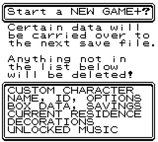
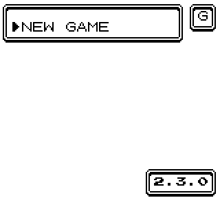
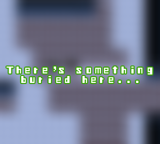
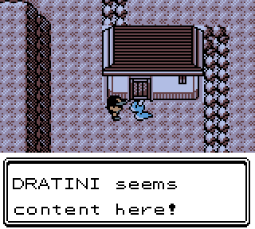

2.3.0
--------------
## New Features:

#### New Game+:
Added **New Game+**
 - Unlockable by beating the E4 rematch
 - Accesible by holding START when selecting NEW GAME from the main menu
 - Allows you to carry over certain things into an otherwise fresh save file

**Things carried over:**
 - Box data + names
 - Decorations including the BIG ROCK
 - Unlocked music/Dex Tracker upgrade/DV Vision
 - Dex settings
 - Music settings
 - Options
 - Bank money and setting
 - Current residence and configuration
 - Character, palette, name and IDs

Please note that your party and daycare data _will_ be wiped, so be sure to make sure anything you want to save is in your boxes! After starting a NG+ and getting your starter(which you can still SR for,) the game will be forced to save in order to complete the initialization process.

This won't make the game any harder, but there is a small easter egg that will be available until starting the Suicune quest.

#### Goomba support:
Added **Goomba support.** For a long time, even vanilla Crystal wouldn't play nicely with the Goomba emulator. Usually I don't go out of my way to address inaccurate emulators, but Goomba is a special case in that it's the only way to play CC on certain consoles.

This is an option that you can enable during the patching stage when using Allen's site. In the interest of future-proofing, this mode can also be enabled by changing 0x0EC5 to 01 using a hex editor. When successful, the main menu screen will display a "G" in the top right corner, like so:

This feature is best described as **EXPERIMENTAL.** There may be graphical bugs that I didn't find, and some that may not be addressable. A few things will also be slightly different; for example the map name sign no longer slides up and down when entering an area. However, it should at least make the game far more playable than it was before. If you don't understand any of this, chances are you don't need to worry about it.

#### New Events:
Added a **new event** to Cinnabar Mansion B1F.
 - Bring a follower that knows Dig.

## Map Changes:

 - Added an unlockable residence to Dragon's Den B1F
 - Added headbutt data to Dragon's Den B1F

 - Returned a set of twins from the Captain's Cabin to their original cabin on the S.S.AQUA

## QoL Changes:
 - Residence PCs now ask which kind of PC you want to use.

 - Wild shinies no longer hit themselves while confused.

## Battle Tutor:
 - Added Dream Eater to Butterfree
 - Added Glare to Beedrill
 - Added Agility, Meditate, Barrier to Venonat and Venomoth
 - Added Kinesis to Clefairy, Clefable, Jigglypuff, Wigglytuff, Vulpix, Ninetales, Psyduck, Golduck, Slowpoke, Slowbro, Drowzee, Hypno, Exeggcute, Exeggutor, Chansey, Mr. Mime, Jynx, Porygon, Articuno, Zapdos, Moltres, Hoothoot, Noctowl, Togepi, Togetic, Natu, Xatu, Slowking, Misdreavus, Unown, Girafarig, Pineco, Forretress, Porygon2, Stantler, Blissey, Raikou, Entei, Suicune, Lugia, Ho-Oh, and Celebi

## Fixes:
 - Fixed Flame Body extra steps not correctly returning egg hatching status
 - Fixed roamers not resetting properly from the E4
 - Fixed the dex not correctly checking owned species for E4 resets
 - Fixed Hidden Power palette messing up other move animation palettes
 - Fixed the Ruins of Alph shrine changing the wrong tile
 - Fixed Tin Tower 1F Suicune preroll code not properly clearing out rolled DVs.
	 * This means Suicune is now properly chainable, and works the way the documentation says it does.
 - Fixed character customizer not disabling map animations
 - Fixed incorrect nickname for the Sazabee palette
 - Fixed riding the S.S.Aqua from Kanto instead of Johto creating a bad state for the map.
 - Fixed bonus egg moves added from chaining resulting in duplicates for certain species
	 * This means in rare cases that an egg move is not always guaranteed.
 - Fixed hovering followers not resuming hovering after using Dig
 - Fixed renaming the follower to a nickname palette not immediately updating its palette.
 - Fixed the Cafe Train animation not clearing out its tiles when on cooldown.
