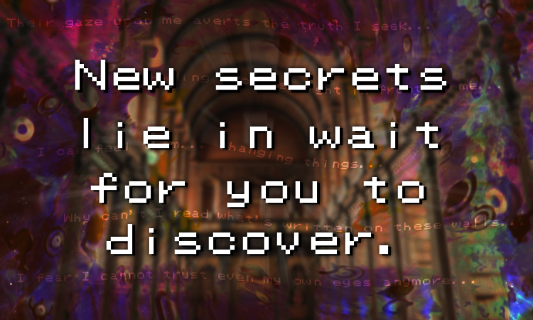
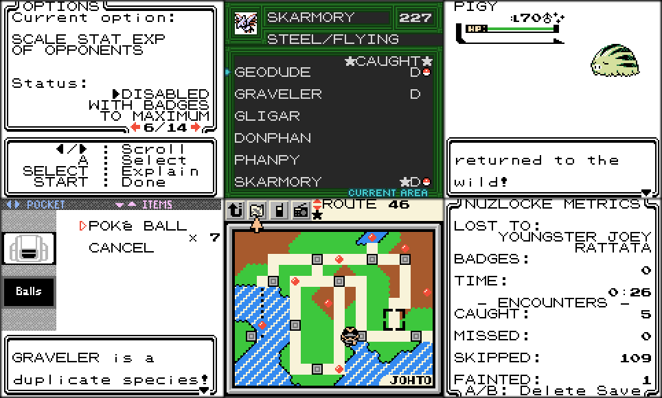
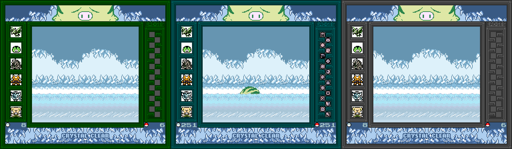
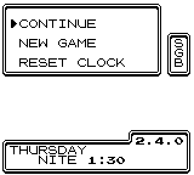
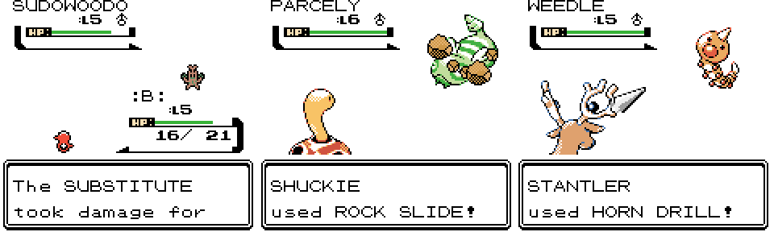

2.4.0
--------------
## Credits:

Art:
 - Maddalena (new Ruins of Alph puzzle, SGB Border Pigy)
 - OfficialDracula (new Ruins of Alph puzzles art)
 - BloodlessNS (improved Surprised Pika art)

Bugtesting:
 - Cedsi
 - Allen
 - CasualPokePlayer
 - Jabbie
 - Gio
 - Jelestine
 - KC
 - Lamanitekmg
 - LibertyPrime
 - Mannmehta04
 - Red Dragon Alexis
 - News
 - Fef
 - Pies
 - RBL JOKER
 - Sauce
 - Smelly-Ghost
 - TreeSquid

## Preface:

If you've been around a while, you'll know that by and large, when CC gets updates, there's a lot of little tweaks or entirely supplemental features - but almost never any additional playable events. 2.4.0 is a rare exception; I've spent some time (and space) coming up with some extra stuff for the player to do. This wasn't really something that I was planning on doing; it mostly stemmed from a buildup of gaps in terms of both lore and gameplay that were overdue for some attention. So, I've come up with a little something that should be a fun challenge for those looking to experience something new in CC.

While the new event does lean towards being "post-game content," it does not require any badges to complete. It is also split into two halves, either of which can be started without the other, but both are required to complete it fully. 

Given how rare it is for something like this to come along, **I've opted to keep event-relevant details and changes out of this changelog to keep it spoiler-free.** Believe it or not, the new event is the smaller half of the update, so there's still plenty to go over. Anyways, let's get into it.

# New Event:

Those who have lived there all their lives will often tell you about the mystical properties of Azalea Town. From the mysterious Ilex Forest, to the depths of Slowpoke Well, there is no shortage of text on the pages of its history. However, there are only few that give credence to one of the oldest legends surrounding this ancient town. And those that do will often claim they can see eyes watching them between the branches. Perhaps the story of a vanishing forest was merely a tale used to scare children into coming home before nightfall. But like many old legends, there may be a hint of truth to its origin.

# Nuzlocke Mode:

I'll be honest - until this update I've never even attempted a Nuzlocke, so working on this feature had an extra level of challenge. And admittedly, the main reason that I wanted to create a Nuzlocke mode was because I wasn't attracted to the idea of having to keep track of everything myself. So I figured I could probably figure out how to get the game to do it for me. It quickly became a much larger project than I had envisioned, because I know that there are a lot of different clauses that people like to play with to tweak the difficulty to their own playstyle. Naturally I wasn't able to implement everything, but I was able to get a lot of different options in. Hopefully you'll find something you like!

**You can start a NUZLOCKE CHALLENGE by holding SELECT when starting a New Game.**

Certain things will be disabled in order to keep the challenge from breaking in half. These are listed in game. Of note, the second part of the new event is disabled because it cannot be completed during a Nuzlocke, and the AI missing/failing clauses are lifted during a Nuzlocke as well.

After starting a new game in Nuzlocke Mode, you'll have the option to read some text explaining what a Nuzlocke is, and another section on how it affects the overworld in CC. **Even if you're a Nuzlocke veteran, I recommend reading both text prompts at least once,** as both have CC-specific information on how the game handles certain mechanics. The text is as brief as possible.

After that, you can **customize your Nuzlocke options.** These can't be changed after the challenge has started, so choose wisely. Each option has an in-game explanation of how it works. Just press SELECT while looking at each option. As of 2.4.0, there are 14 unique options, 2 of which have more than one setting.

 - Options:
	 * Game over when whiting out
	 * Allow capture of shinies regardless of encounter state(1)
	 * Shiny party members can faint once
	 * Duplicate species are treated as failed encounters(2)
	 * Limit experience growth based on badges
	 * Scale Stat Exp of opponents(3)
	 * Randomize starter choice
	 * Prevent capturing certain species
	 * Prevent the use of items in battle
	 * Prevent held items
	 * Exp.Share has no effect
	 * Prevent running from battle
	 * Prevent asking to switch
	 * Don't allow the use of fly

(1) Full-odds only, so chaining cannot be used to exploit this clause. There's a limit of 3 per save file.

(2) CC introduces its own unique Split Evos clause, which don't count as dupes if that evolutionary lines encounter is the opposite form. This normally wouldn't come up, but CC has all Split Evos as encounterable species. Additionally, this rule must be left disabled to use Swap Chaining (see below.)

(3) When set to scaling, if "Limit experience growth" is enabled, Stat Exp will cap at the current amount. Stars will appear on the status screen to indicate when the current stat is capped.

During a Nuzlocke challenge, a few resources become more useful:
 - The Area Tab of the Dex will show duplicate species, as well as the encounter status of the current area
 - Any Town Map will show the encounter status of that landmark
 - During wild battles, the enemy's HUD will display the encounter status:
	 * "!" for a catchable first encounter
	 * "D" for a duplicate species when first encounter is still available
	 * "F" for an uncatchable first encounter, when dupes clause is disabled
	 * "x" for everything else (uncatchable species or legends)
	 * The shiny symbol will appear for catchable encounters under the shiny clause
 - The challenge can be ended manually from the trainer card screen, and a reason for ending it can be selected.
 - The Applicator is always in effect.

Given that this is an entirely new way to play the game, there's bound to be things that I missed. The staff and bug testers have worked tirelessly to find everything they can, but there's a _lot_ that could go wrong. Don't hesitate to ask in the discord if something doesn't seem right!

------

During the streams leading up to release, it was discovered that chaining still has utility during a Nuzlocke, provided that "Duplicate species are treated as failed encounters" is left disabled. This allows "manipulating" the default Dupes Clause to get the exact DVs that you want for a party member, and is called Swap Chaining.

 - To Swap Chain:
	 * Pick a target species and make sure it can be found in at least two different landmarks where you still have encounters available. Knowing the encounter types, rates, and times of day will be important.
	 * Catch the species you want to chain for on the first landmark. This will register the species as a duplicate, and give you a safe place to build up a chain. You will need this party member later.
	 * Build a chain of that species in the same area. The higher the chain, the safer this will be. Once built, disabling the chain is wise.
	 * Determine what species could appear in the second landmark that are not the target, and catch them anywhere but the second landmark. You only need to do this for the target time of day, and encounter type (so if your target species is only in the grass at night, you can ignore headbutt encounters and anything that only appears during the day.) If your chain or target encounter rate is high enough, it's possible to omit this step, but remains risky.
	 * Enable the chain (if needed) and enter the second landmark, with the species you caught earlier in your party. It may be helpful to lower its HP or poison it beforehand.
	 * Since every possible encounter is a duplicate, nothing can be caught. So keep running away until you find the target species with the DVs that you want.
	 * Once you've found the species you want, send out the one from your party, and let the enemy faint it.
	 * Since the enemy species is no longer a duplicate, the HUD will update to reflect that it's now a valid encounter! Now you can catch it.
	 
Swap Chaining may seem complicated at first, but with a little practice it can be used to build an optimal team without being at the mercy of RNG, in exchange for spending a handful of encounters. In terms of balance, since encounters are a non-recoverable and extremely limited resource, and Swap Chaining is a lengthy process that simultaneously evens the playing field while upping the ante(as losing a Swap Chained party member could be devestating enough to end a run,) I decided to leave it in.

# SGB Border:

This one's going to take a little explanation, so bear with me here. **This does not mean that CC is now compatible with the SGB,** that can't happen for a variety of reasons. Instead, this functionality has been "readded" to fill a very specific niche - **streaming overlays.** If you're familiar with it, then you know how cumbersome CCGen was to get set up and use. This is an emulator-based alternative, that features the added bonus of having the game automatically update your border for you, at the cost of a minor delay.

The SGB Border:
 - Loads and displays metrics like the party icons, seen/caught amount, and badges
	 * Party display supports shininess, nickname palettes, and Unown forms
 - Loads the Dex's current theme for border colors
 - Has similar art to the intro
 - Automatically updates when applicable, and can be updated manually by pressing SELECT while the Start Menu is open. While the border is updating outside of natural game transitions, the screen will quickly fade to white before fading back in.

This is an option that you can enable during the patching stage when using Allen's site. In the interest of future-proofing, this mode can also be enabled by changing 0x146 to 03 and 0x14D to 24 using a hex editor. When successful, the main menu screen will display "SGB" in the top right corner, like so:

Usage:
 - You'll need to enable the SGB Border using [Allen's site](https://inject.fm1337.com/patch) or by modifying the header directly first.
	 * Note that this WILL break Stadium 2 compatibility, however - the save data can still be used with vanilla Crystal or a non-SGB copy of CC to get around this limitation.

 - BGB:
	 1. In Options > Graphics > "show border", tick "only SGB border"
	 2. In Options > System > "Emulated system", tick "SGB + GBC"
	 
 - Goomba:
	 * By default, Goomba will not load the border. The following must be done on each boot (for now)

	 1. Press L+R to open the Goomba menu
	 2. In "Other Settings", set "Game Boy:" to "GBC+SGB"
	 3. Return to the main menu and select "Restart"
	 4. The border will now work correctly, however the graphics will glitch slightly when updating.

Other software may or may not support this particular method of emulation. Beyond that, several things were omitted or tweaked to increase transfer speed, which may hinder compatibility. For example the GB Tower in Stadium 2 is unfortunately not compatible with these changes.

# Gameplay changes:

 - Added Union Cave B3F (new area!)

 - Added 6 new species prizes to a new prize vendor in the Underground Arena
	 * These can be soft-reset and have the same boosted shiny chance as the other giftmons

 - Added a bonus puzzle to the Entei Chamber.

 - Riding the bike now allows the player to headbutt without having a party member that knows it.

 - Added Voltorb to Route 38 and 39 at night, and Route 6 and Route 11 during Morn/Day
 - Added a stationary Voltorb to Radio Tower 4F (resettable via e4)

 - The final battle now has Stat Exp.

 - Lucky Punch now has a secondary effect: when held by any species, it will double the added catch chance from status.

 - Added Piloswine footprints in Ice Path B3F, and Voltorb footprints to Route 6, 38, and 39

 - Dratini and Shuckie are now Lv10 instead of 15

 - Sprout Tower 2F sage won't permit entry unless the player has at least one party member above lv 20

 - Minor level tweaks to sets 14 and 15 for Gym leaders
 
 - Blue's Squirtle line is now more balanced

 - Added Nuzlocke team from the streams to the Battle Sim (for a limited time!)

## Reworked Headbutt data
 - Species are distributed more evenly
 - A few new species have been added
 - A few maps now are in different groups
 - Updated the sleeping tables to reflect the changes (plus a few that were missing)

## Specialty Ball Reworks:
 - Item descriptions have been rewritten to be more useful
 - Prices have been tweaked to better reflect their utility

Nerfed:
 - Level Ball no longer skips the HP and Status checks

Buffed:
 - Heavy Ball now uses lbs instead of kg, and has been bumped down to the 200-400lb range (which adds way more species to the list)
 - Heavy Ball no longer has a negative effect if the species is too light
 - Lure Ball now also applies to Headbutt and Rock Smash encounters
 - Moon Ball now applies to any species that evolves with a stone
 - Friend Ball retains its original effect of boosting happiness, but now is also 4x for any species that evolve via happiness
 - Love Ball no longer requires the same species, only opposite genders, but is now only 4x instead of 8x.
 - Park Balls (in the Bug Catching Contest) now have the Level Ball boost if applicable, but otherwise remain 1.5x like the Great Ball.

# Quality of Life Updates:

 - Pressing START to highlight "END" on the nickname screen is now disabled when reset is disabled.
	 * This is to prevent imperfect SRing over a shiny.

 - Encounter-based soft-reset loops can be broken out of by holding UP+SELECT.

 - Celebi can now be reset via the E4. This is not in Ilex Forest, check the Dex for more info.

 - Sweet Scent message is now skipped if Quick Encounter is on.

 - The Underground Arena now has viewable ban lists.

 - Increased water encounter rate in Cinnabar Tunnel

 - Added a handful of game mechanic explanations to the blackboard in the Modification Stations.
 - Added some stationary roamer hints to the sketchbook in the Modification Stations.

 - Added Compound Eyes pseudo ability to: Magneton, Dugtrio, Doduo, Dodrio, Exeggcute, Exeggutor, Kangaskhan, Girafarig, Weezing, and Slowking

 - Filling up the box while fishing will now end the "Keep fishing?" script (otherwise Bill's call wouldn't happen)
 
 - After successfully using Sweet Scent and completing the battle, the player will be prompted to "Keep using SWEET SCENT?"

 - Cafe blackmail price increased to 1200 points (enough to get a species prize or leaf pack once.)

Stat Exp buffs:
 - Goldenrod Cafe now applies 3x if party member is infected/cured
 - Battles now apply 3x instead of 2x if party member is infected/cured
 - Stat Exp items now apply 2x if party member is infected/cured

# Battle Tutor Updates:

Howdy folks, it's Grizz again!  Another update, another expansion for the Battle Tutor.  This one isn't as big as the last upgrade, but it adds some fun new tools for species that didn't get much love previously and also adds support for some explosive new combos!  I look forward to seeing how these additions are put to use out there in the field.  Go and win some battles!

# Visual updates:
 - Added a new sprite and palette for the cave-in in Cherrygrove Bay Cave.
 
 - Granbull, Sandshrew, Doduo and Dodrio now use white in their overworld sprites.
 
 - When Weird Grape isn't unlocked on the title screen, the "O" is now filled in
 
 - Redesigned the champion's room and sprite, and updated the cutscene room before the E4

 - Minor tweaks to Mt.Moon tileset and blockdata for consistency

# Misc tweaks:
 - The following areas are now listed as landmarks:
	 * Cinnabar Tunnel
	 * Cinnabar Mansion
	 * Underground Arena
	 * Silph Co.
	 * Cherrygrove Cave
	 * The Forge
	 * Route 24 Cave

 - Tweaked spacing on some landmark strings so they'd look better.
 - A handful of minor fixes for Goomba mode have been added
	 * This includes moving the applicable byte to $3FFF
 - "Trap" battle type now prevents enemies from fleeing
 - Added new Unown puzzle designs courtesy of OfficialDracula and Maddalena
 - Rewrote some of the intro text, which can now only be skipped by holding SELECT.
 - Added a Route 32 entry for Sudowoodo in the Dex.
 - Tweaked Cat's win/loss text
 - PSNBERRY is now also a nickname palette for HP poison for Sudowoodo
 - Rowdy Pigy now has his own battle start text
 - Added/Updated follower map text for the stationary chambers, Mt. Mortar Peaks, and the Champion's room
 - Added following recent event for the lake of rage gyarados (since it can wander)
 - DoubleSpeed is now used when reloading sprites and tileset from menus
 - Minor tweaks that might help menu transitions sound better
 - Fixed Slowpoke Well B1F's footprints being overleveled and added Dunsparce footprints
 - Moved Lass on Route 33
 - Moved the Sailor in the Underground Arena
 - Moved a Fisher in Mahogany Town
 - Luster and Booster Balls can no longer be obtained via Gen 1 trades
 - Trading now requires the traded party member to be alive
 - Tutorial Rattata now has hardcoded DVs
 - Minor animation tweak to make it clear who is talking during the pre-E4 cutscene
 - Teleporting follower script now has a chance to give a Gold Leaf instead of a Silver Leaf

# Bugfixes:
 - A lot of internal optimization, compression, and relocation to make space.
 - Minor tweak to the Kenya quest text to avoid using text macros.
 - Changed Mt.Rose's last known legal landmark to Blackthorn City
 - Added last known legal landmark handling to the maps it was missing on
 - Fixed a weird map connection half-tree error when coming from down from the Lake of Rage near Mt. Mortar Peaks 
 - NPC trades now try to restore the correct follower.
 - Fixed "You blew it" handling not accessible because of player warping - this now only triggers once.
 - Fixed character customizer not loading the correct skin/color data when immediately re-entering the tab.
 - The Dex's main screen now uses single inputs without scrolling(except for when hovering over the species)
	 * This fixes a bug where inputting a direction and a button too fast would cause the cursor to slide too far.
 - Toggling shininess in the Dex will now correctly override the previous sound effect.
 - Fixed intro text having incorrect colors
 - Fixed displaying +1 Reroll animation over the stats box if a party member levelled up at the same time.
 - Added "No Room" handling to some key items that were missing it
 - Fixed a bug with the dex not allowing music to fade if opened too quickly when entering a map
 - Fixed substitute wipe animation playing unneccessarily when failing to use Fly or Dig.
 - Substitute and Minimize no longer play the cry animation when swapping in (via Baton Pass)
 - Teleport follower script no longer has an emote (could glitch certain map palettes)
