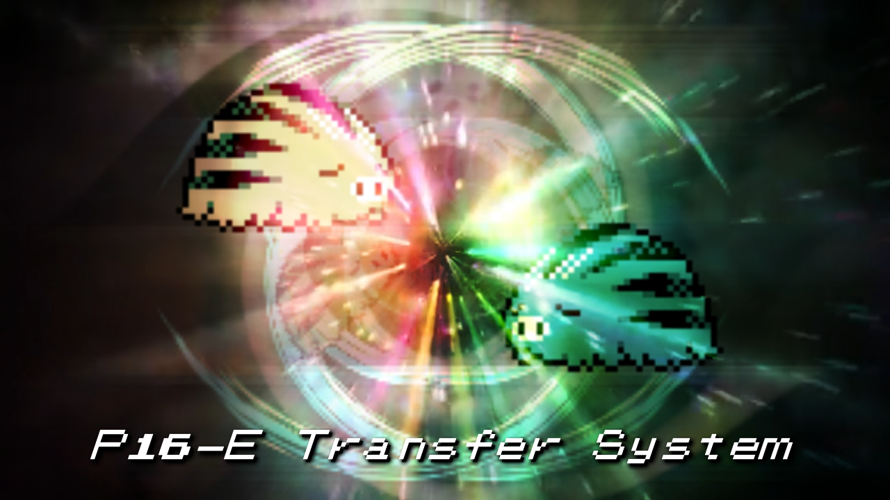
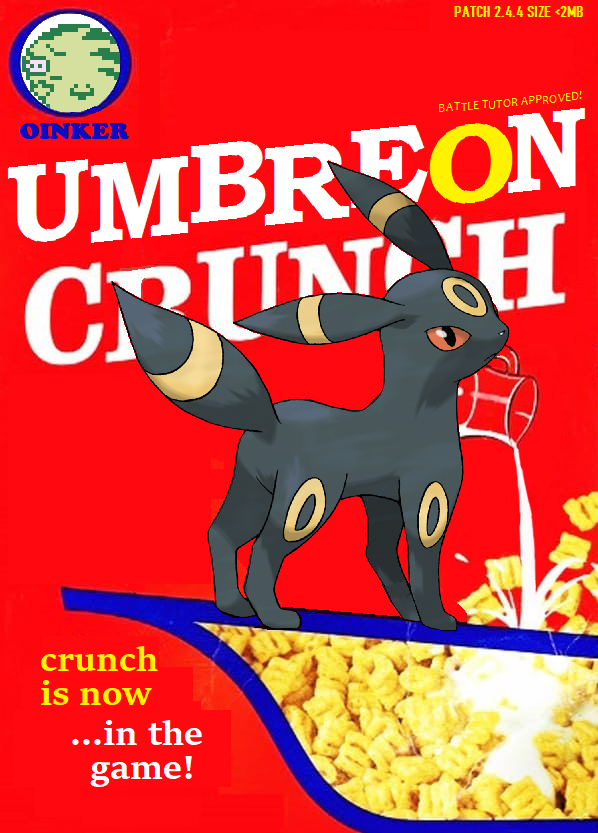

2.4.4
--------------
**Preface:**

There's actually a lot more I wanted to fix in this update, but the new feature outlined below prompts a much earlier release. Noticably missing are some minor Stadium 2 and SGB border fixes, as I haven't had the time or means to work through these properly. But I expect there'll be additional bugs introduced that'll need fixing, so perhaps those will all come together in a future update.

**New Pig:**

Howdy, it's Researcher Grizz again. You may be wondering about the new automated helpers installed in the centers across the Kanto and Johto region. These friend-shaped automatons are the latest design in trading and transferring technology: the sixteenth edition of the Transfer Interface or "P16-E" for short. What happened to the previous fifteen editions? Don't worry about that. Next question: What do they do? The P16-E system allows trainers to share with each other without even needing to meet in-person! You can either arrange a trade with a friend, or make a blind trade for something another trainer is offering!  Swap out that teammate that isn't getting along with the rest of your party, or catch something simply for the sake of trading it and seeing what you get in return! You never know what the P16-E system might give you!

**New Features:**

[(Youtube Video)](https://www.youtube.com/watch?v=Ng56NrulwJQ "Transfer System")

Have you ever wanted to trade with other players online? Well now you can! Introducing the Save Transfer system, developed almost exclusively by Allen and Cedsi. These two exceptional individuals worked together to come up with all the details needed to allows anyone in the Discord to trade safely and quickly. Basically all I did was knock out the in-game NPC and a small console app to move save data around.

Trading is very easy, and can be done even from a mobile device.

So aside from the obvious perks such as exp growth, why would you want to trade? Well, to add some extra flair to trades, I've added a single "traded" nickname palette slot. So if the OT puts a custom palette on that mon, it will be transferred alongside it! This should be especially fun for players seeking to build chromatically themed teams.

Regular trading not disco enough for you? Well, then how about Wonder trading? That's right, these mad lads even worked out how to fit that into this system.

Lastly, if you're not interested in trading but still want to try out the system, we've also baked in some promotional giveaways that you can just outright download to your save file.

**Battle Tutor:**

**Fixes:**
 - Trading Unown will now show the correct forms and play the correct animation
 - The Dex now handles Arena prizes correctly
 - Tin Tower 1F Suicune battle now allows the player to lose, and will correctly determine Suicune's caught status regardless of trades, transfers, or NG+
 - Minor text fix for Eusine's after battle text
 - Eusine's object script will now fix the event for saves that failed to complete it correctly
 - Applied a handful of fixes regarding how gender is saved and transferred through NG+
 - New items will display correctly on the stats screen outside of the Time Capsule
 - Fixed entering the Hall of Fame with max length nickname palettes not displaying correctly
