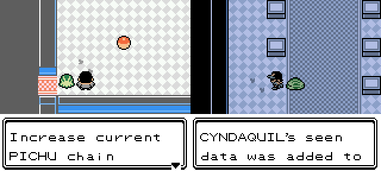

2.5.2
--------------
**Preface:**

I had a bit of time, so I fixed a handful of bugs and tweaked a few minor things. I didn't get to everything, but was able to squeeze in a little QoL after freeing up space for the bugfixes.

**Quality of life:**

 - Inspecting footprints of the species currently being chained will offer upping the chain to 25 if the current chain is less than that.
 
 - Added footprints to all 4 floors of Cinnabar Mansion and the Power Plant.

**Fixes:**

 - Fixed Surfing Pika breaking the trade in Cinnabar Tunnel
 - Fixed disabled music softlocking the Origin Plains cutscene
 - Fixed Crobat getting Reflect instead of Mega Drain via Kanto TM Tutor
 - Fixed Omanyte not having Waterfall via Battle Tutor
 - Fixed eggs not being detected by the Legality Fixer
 - Fixed "Pigy(?)" oinking outside of the box
 - Fixed Lavender Town's connection to Route 8 being too short
 - Removed a small mountain on Route 12 that was causing visual issues
 - Added missing PIBLU nickname palette entries
 - Potentially fixed leftover cake
