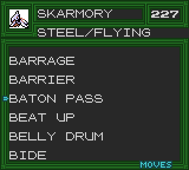
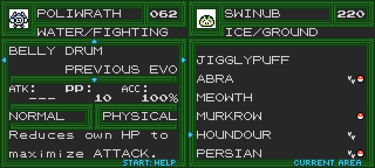
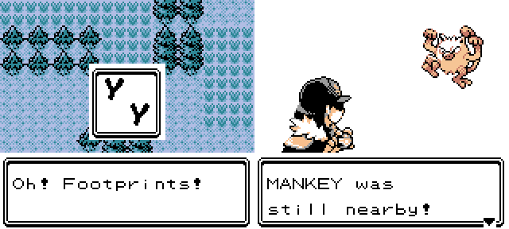
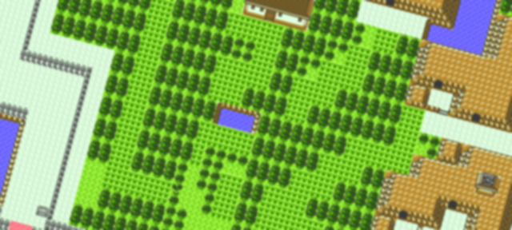
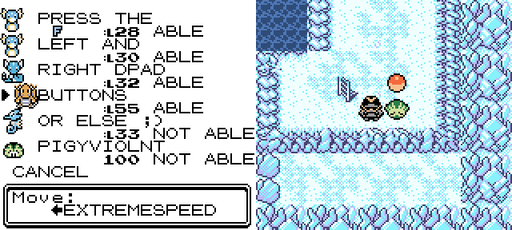

2.5.3
--------------
## Preface:

Despite not being a major content drop, this is easily one of my favorite updates. I've managed to add some new features to the Pigydex that I've personally always wanted, and I've fixed a lot of bugs. There's also some new QoL additions and some tournament-centric stuff that I'm sure everyone will enjoy. 

## Pigydex Upgrades:

If you've ever used the Moves search feature of the List Tab, you'll be all too familiar with the amount of time it takes to actually pull up the list. Checking every species and every learn method for a move is a time-consuming operation, after all. Even if it is fun to watch the little animation of Pigy getting the cake. But worry no longer: **this function has been upgraded and is now instant!**

It gets better; now once you search a move, it will be displayed at the top of the screen. From here, you can **Refine** your search by pressing **SELECT** again, and the list will update with every species that learns both moves. This can be done up to a total of 4 times, and the top of the screen will animate through the list of currently selected moves. Selected moves will also be sorted at the top of the refine list and marked with a star.

*Want to quickly find every species that can Baton Pass Agility? The Dex has your back.*

There's more - previously, the Dex had a significant oversight regarding searching moves - both in the List Tab and in the Moves Tab, there was no handling for moves only learned by previous evolutions. That has been fixed, so all Moves-related operations are now 100% accurate. You might be thinking of one thing I might have missed, don't worry, we'll cover that a little bit later.

Lastly, there's one other new feature - the Area Tab now displays which species have footprints appear in the overworld. This should help with filling out the Dex as well as finding the areas that may best suit your chaining needs. You may even discover species not normally found in the grass...

*The footprints icon will also appear in Nuzlocke Mode alongside the other Area Tab icons.*

**Misc tweaks:**
 - Changed "press" to "hold" in the RGB tweaker deletion tutorial
 - Fixed legendary quests skipping ahead to reset status under certain conditions

## Footprints Rework:

With the Dex now showing footprints, it was only natural that this feature would be used to help find areas where the feature was a little weak. So 2.5.3 comes with a few minor tweaks and reworks to certain areas to make the feature a little more useful. Some of these areas even have headbutt-only species appear as footprints now.

Areas with reworked footprint data:
 - Route 37
 - Route 29
 - Route 30
 - Route 31
 - Route 45
 - Route 7

**Misc changes:**
 - Tweaked Cinnabar Mansion to avoid symmetry issues with footprints near the entrance
 - Moved footprints on Route 11 that were too close to Grullo Gorge, causing a visual glitch
 - Fixed Burned Tower B1F not having footprints after releasing the beasts
 - Fixed Safari Zone Cyndaquil footprints being one level too low

*You are no longer safe on the first route of the game.*

## Expansion:

 - Slightly expanded Route 35.

This fills out the last gap between all the surrounding maps in that area. There's a couple goodies on the ground and a mysterious house, which may be linked to the Ruins of Alph. Worth a visit before and after completing the quest, for sure.

*By far the smallest expansion ever!*

## Quality of life:

Added the Dragon Tutor in the Dragon Shrine
 - After a small quest, he can teach Barrier or Extremespeed to Dratini, Dragonair, or Dragonite.
 - Added handling and an additional Help page to the Moves Tab of the Pigydex to reflect this addition.

Beth will remain in the Underground after clearing the Arena until you've unlocked the secret residence at least once. She will also appear on Route 40 from then on if you want to switch back to that residence.

Visiting Silver Cave Outside will unlock "Blood Drain Again" if Birdkeeper Ced has been defeated. This fixes legacy save files who may have missed the normal music unlock event, since he disappears after battle to provide access to the hidden ledge.

Battle Tower Ruins now switches palettes correctly based on time of day.

Slight visual tweak to the hidden ledge in Seafoam Islands B3F.

*I thought animated arrows would be enough. Somehow, it wasn't...*

## Battle Tutor Changes:

This is the first ever balance update for the Battle Tutor. After lots of internal discussion and community results, we've removed a few things and added a lot more. While typically I am against nerfing things in a largely single-player experience, this was done to keep things friendly for tournament newcomers, as species-specific moves bans are a bit much to ask people to keep track of out of the gate.

Additionally, Curse is now allowed in the arena again when using the Pigyournament ruleset.

We have also dished out a handful of new moves to help boost the viability of certain species, with our focus largely being on polishing up fighting types who needed an extra boost to keep up with Heracross and Machamp. Here's the full breakdown:

**Nerfs:**
 - Aerodactyl loses Rock Slide
 - Heracross loses Rock Slide
 - Jumpluff loses Substitute
 
**Buffs:**
 - Girafarig gets Confuse Ray
 - Forretress gets Psych Up
 - Piloswine gets Bone Rush
 - Donphan gets Bone Rush
 - Granbull gets Safeguard
 - Vileplume gets Safeguard
 - Bellossom gets Safeguard
 - Seaking gets Belly Drum
 - Delibird gets Belly Drum
 - Primeape gets Belly Drum
 - Hitmonchan gets Belly Drum, Safeguard, and Baton Pass
 - Hitmontop gets Belly Drum, Rock Slide, Cross Chop, Drill Peck, ExtremeSpeed, and Megahorn
 - Hitmonlee gets Belly Drum, Swords Dance, and Low Kick
 - Poliwrath gets Mach Punch, and Karate Chop
 - Pinsir gets Wing Attack and Glare
 - Yanma gets Outrage and Dragonbreath
 
**Misc changes:**
 - Dratini, Dragonair, and Dragonite now get access to Extremespeed and Barrier through the Dragon Tutor
 - Fixed Slowking not getting Sludge, Kingdra not getting Skull Bash, and Octillery not getting Mist via the respective tutors

## Fixes:

 - Fixed part of the Mirror Ball machine script not waiting for sound effects to finish playing.
 - Fixed inconsistent "rushing water" text events in Lake Tohjo.
 - Fixed the pickaxe animation in Cherrygrove Bay Cave showing a glitch frame when the rock disappears.
 - Fixed incorrect open quotes in League calls.
 - Fixed SGB border badges not matching trainer card after Janine/Sabrina swap.
 - SGB border now disables OBJs when updating, which might fix border display issues for certain emulators.
 - Tin Tower 1F Sage will now attempt to open the stairs even if you've fought Ho-Oh.
 - Experimental fix for objects appearing over grass tiles when they respawn when the map reloads.
