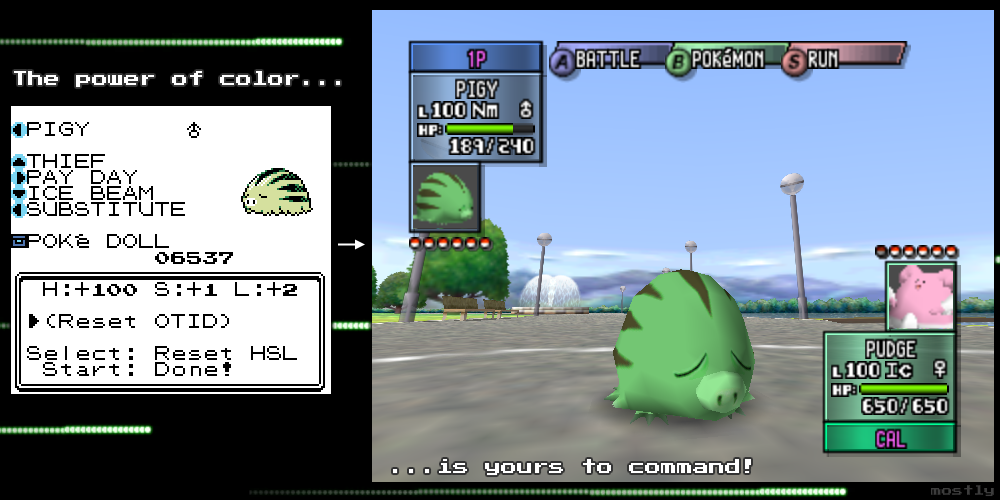
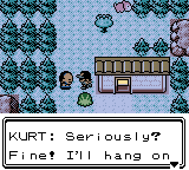

2.5.4
--------------
## Preface:

Huh? Again? So soon? Yeah. This is mostly an update to add Battle Tutor additions, and a few minor bugfixes. I'll also be using this changelog to cover the new Stadium 2 HSL OTID System.

## Stadium 2 HSL OTID System

This is an advanced but hacky feature that has no bearing on regular gameplay, so if you're not interested in Stadium 2 then you can skip this segment.

[(Youtube Video)](https://www.youtube.com/watch?v=aVNR-Xv6xgc "HSL OTIDs")

## Quality of life:

 - Obedience and Boosted Exp checks now check the OTName instead of the OTID
	 * This makes trading between your own save files less troublesome.

 - Types and Egg Groups are now alphabetically ordered in the List tab's search feature in the Dex

## Battle Tutor Changes:

The grand majority of these were in development before the previous tournament, so it didn't make sense to release them until now. A lot of thought by people a lot more competitively viable than me has been put into these changes, and this time around there's only one nerf that was required to make a buff not completely unreasonable:

 - Gyarados loses access to Super Fang, but gains access to Aeroblast in return.
 
The rest of these changes are too lengthy to post here, so I'll quickly mention a few notable things: 

 - We've passed out more Baton Pass, and plenty of new hazing, phazing, and raising options.
 - Due to the Pigyournament format's removal of sleep, we've passed out a lot of alternative status options.
 - Tyranitar has recieved a handful of new moves for the first time ever.
 - Sneasel got a lot of new moves as well.
 - There are new users of Sacred Fire and Aeroblast that are sure to shake things up.

## Fixes:

 - Chronicler Robert is now Chronicler Rowan.
 - Fix a minor visual glitch when entering the Dex's info tab for certain species
 - Added full bag handling to Kurt returning the GS Ball to the player
 - Minor visual fix for the Ruins of Alph
 

*Look, if I could magically increase bag space I would.*