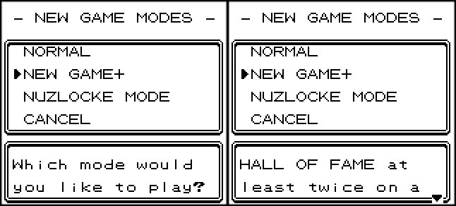
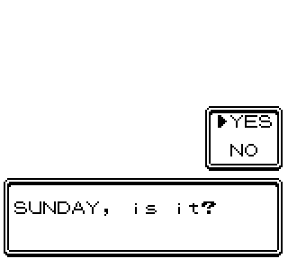
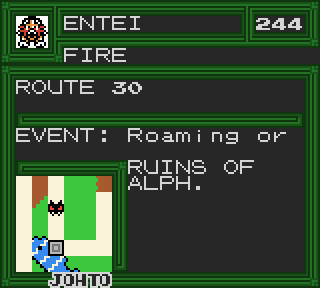
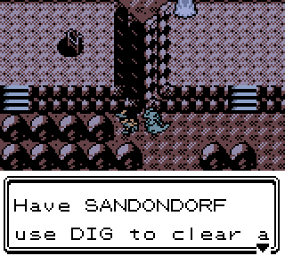
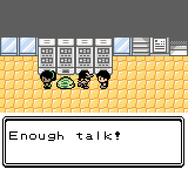

2.5.6
--------------
## Preface:

This changelog contains spoilers for the E4, and outcome of the Alph Forest quest.

Recently, in a big text post about the state of the game, I mentioned that I saw the next update most likely happening as a spur-of-the-moment thing. And that's...pretty much exactly how it went down. Most of this was knocked out between 2-3 small sessions. That said, I was still able to knock out a few extra QoL features and minor additions that I'm sure plenty of people will enjoy.

## Quality of life:

 - Added a New Game Selection Screen
 
 
 
 - Added a loading bar animation and sound effect for the "Skip intro text with Select" prompt
 
 

 - PP Up is now PP Max

 - Legality Fixer now properly detects purely illegal moves, and has proper handling for Extremespeed on the Dratini family

 - When the requirements are fulfilled for making a roamer stationary, it will display as such in the Dex's search tab
 

 - Added a broken TV in Route 35 house to help with the final tablet puzzle

 - New Game+ now carries over the Ancient Pick; you will not be able to get a second one.

## Gameplay Changes/Additions:

Gift bonus shiny rerolls (starters, game corner, etc; not chaining) now have a new effect on the final DVs: **it is now much more viable to soft reset for perfect DVs.**

The way this works internally is, after each unsuccessful shiny roll, each DV has a 50% chance to maintain a roll of 15 or 10. If all four DVs hit these rolls, and this final maintained set of DVs is shiny, they will be used outright (this is unlikely, but possible.) Otherwise, any maintained rolls will be merged with the last rolled set; this can result in a shiny under certain conditions, but largely has the effect of making the final set of DVs higher overall.

 - Updated Champion and Final Battle teams. This was not done to make the battles more difficult, but rather to reflect new preferences.

 - There are two new hidden tile events:
	 * One can only be accessed at night, after completing the Sprout Tower cutscene on Tuesday. 
	 * The other has a randomized outcome and is behind multiple hidden ledges.

 - The Rooftop Sale can now be triggered manually once by giving a Soda Pop to an NPC on the 6th floor.
 
 - There is a small event with Cat on the roof during the sale.

 - Added water to Rock Tunnel B1F, which is only accessible by having a follower with dig and interacting with rocks near an otherwise inaccessible ladder

 

## Battle Tutor Changes:

 - Added Whirlwind to Natu, Xatu
 - Added Sweet Scent to Swinub, Piloswine

## Fixes:

 - The Arena no longer uses DoubleSpeed while teams are being generated - this may fix a possible crash with certain hardware configurations
 - Fixed Stadium 2 GB Tower softlock when inspecting footprints
 - Fixed using New Game+ after completing Nuzlocke mode not disabling Nuzlocke mode
 - Fixed the Lake Tohjo Mantine surf event crashing
 - Fixed duplicate Battle Tutor entries on Exeggutor
 - Fixed new Battle Tutor menu allowing left/right scrolling in non-compliant menus
 - Fixed opening Laptop after loading map connection breaking tiles
 - Fixed a small visual inconsistency with a few of the pack designs
 - Fixed a typo in Slowpoke text in Azalea Town
 - Fixed footprints on Route 35 using the wrong tile
 - Fixed sprites with hair flip disabled bot disabling on the Gear map when the biking or pika surfing
 - Fixed getting Ditto and Togepi eggs displaying "Error" in the Dex's search tab

 