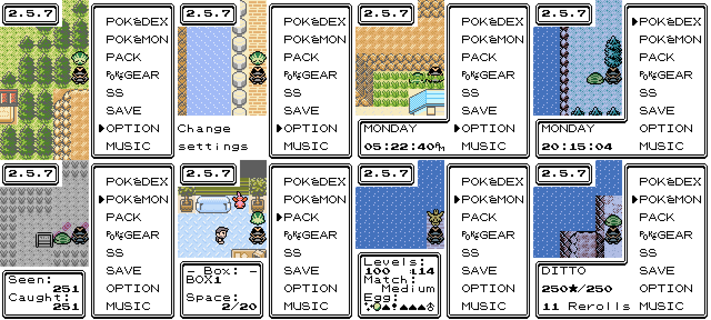
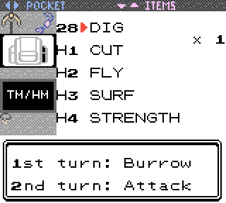

2.5.7
--------------
## Preface:

I'll admit, I didn't expect to put anything out again this soon, but there were a few things that still irked me about CC. This update has one large focus - breeding had fallen off pretty hard in CC given how effective chaining was, and I wanted to address it. So I've added a few new things that you can read about below.

## New Menu Account Options:

The menu account option has largely been pointless for anyone who's played a game before and knows what a start menu is. You can still use it in all its vanilla glory, but for the more efficient, new options now exist:

 - **None:** You need an explanation for "None?"

 - **Default:** The old menu account option.

 - **Day/Time 12hr:** Display the clock, in 12hr format.

 - **Day/Time 24hr:** Display the clock, in 24hr format.

 - **Seen/Caught:** Track your dex completion.

 - **Current Box:** Displays the current box name, and the remaining space.

 - **Day Care:** See paragraph below

 - **Dex Tracker:** Displays the currently chained species, chain length, and total rerolls.

The **Day Care** option requires further elaboration. Besides displaying the parent levels and how likely they are to create eggs, the egg status itself is also displayed, _and can be interacted with._

If an egg is shiny or has max DVs, an icon will be placed to the left of it. On the right, there are 5 indicators for the DVs. A "!" is displayed for any 15 DV, otherwise there will be an up or down arrow for above/below 7, and a "-" to represent exactly 7. Lastly, if applicable, the gender of the egg will be shown.

That's all well and good, but what makes this feature useful is you can **hold left or right** to reject the egg remotely. This works the exact same as if you were to do so in person. So as you adventure, you can manage breeding without having to make the trip back. Additionally, because egg generation is still based on steps, this gives more reason to move back and forth for chaining over using something like Sweet Scent.

All of this information is also available at the Day Care itself. By the way, this is not the only buff for breeding, but you'll have to keep reading to find out more about that.

Last note: this feature is a bit experimental, and sometimes requires some lengthy calculation on loading. I have set up a handful of logic to counteract this, but depending on several factors, opening the start menu may lag a bit with this feature; but it should only be once per session, per Day Care initialization (so, if you swap out parents, recalculation will be necessary.)

## Breeding Improvements:

 - The Flame Body pseudo ability now gives an extra hatching step. (+2)

 - You can now help the Machop man in Vermilion City finish his house by giving him a Brick Piece. By doing so, he will give you the **Oval Charm**, which will be visible in your Pack:

*You can also see the new icons for my Pickaxe and the Gate Key here!*

While sharing a name with a similar item in future gens, the Oval Charm here works a bit differently. First, it gives you an extra hatching step **(+1)**, in the same way that the pseudo Flame Body ability does. This of course stacks with the existing ones, for a total of **4** hatching steps. This should help hatch eggs significantly faster when fully set up.

What makes it unique is that it also gives a second "Day Care step." What this means is that the EXP received from the Day Care is effectively doubled. This also doubles your egg generation rolls. So with just the Oval Charm, you have **2** egg generation rolls. And after entering the Hall of Fame, that goes up to **4**.

Combined with the new Menu Account, I think this should make breeding a lot more accessible and useful. I am hoping that these changes help bring it up to the same level as the other hunting methods.

 - Added a hidden brick piece in Vermilion City

 - The Oval Charm is carried over in New Game+

## Gameplay Changes/Additions:

There are a lot of holdovers and design decisions from earlier in CC's development that used to make a lot more sense. I've now had 5+ years to collect feedback, and have decided to make a handful changes to help ease Dex completion. There are now several species available in the wild that were previously evolution only, and some new obtain methods that might surprise you. Not everything is listed in exact detail here; for that, you'll have to check the Dex!

 - Wild starters have increased levels to blend better with local wild data - this has resulted in middle stage evos being available in certain places.

 - Reworked and rescaled all wild data on all floors of the Seafoam Islands to increase with depth, removing only Zubat and Golbat, and adding Sneasel, Delibird, Smoochum, Jynx, Shellder, Poliwhirl, Staryu, Krabby, Kingler, Mr. Mime and Slowking
 
 - Extended Headbutt and Rock Smash data to add some variety to certain areas and new obtain methods.
	 * 3 new high-level tree groups; applied to Route 44 and 45, Route 26, and Dragon's Den B1F.
	 * 3 species new to Headbutt will be asleep when found at night.
	 * 1 new high-level rock group; applies only to Silver Cave.

 - Added Rock Smash rocks to Silver Cave
	 * These automatically respawn with an animation after all 4 rocks have been cleared.

 - Added Ivysaur to Route 12 and 13

 - Added Pidgeot to Route 14, changed NPC text to reflect this

 - Added Bayleef to Route 15, changed NPC text to reflect this

 - Removed Mareep from Forest of Rage and added Bayleef

 - Added Snubbull and Houndour to Route 16

 - Added Koffing, Weezing, Granbull and Houndoom to Route 17

 - Added Flaaffy, Ampharos, and Magcargo to Route 18

 - Removed Vulpix and added Weezing to Cinnabar Mansion 3F

 - Footprints have been added and adjusted for all affected areas

 - Added 2 new, linked, randomized hidden events.

I'd like to thank **CosmicAngel** for his help in identifying a lot of the weaker points of Dex completion. 

## Quality of Life:

 - Added a Turbo A option, with a small animation in the options menu when pressing A while hovering over it. This is experimental, and should be treated as such.

 - Fishing will now work 75% of the time instead of 50%, and the Suction Cups pseudo ability will bump it up to 100%

 - New Game+ now carries over the Laptop. Older save files will need to update properly in order for this to work.

 - Added pack icons for the Gate Key, SS's Pickaxe, and Oval Charm (see above)

 - Tweaked Gate Key and Pickaxe obtain text to be clearer that they don't go into the pack as key items.

 - Print intensity is now handled by an NPC near relevant printing events, rather than being in the options menu.

## Fixes:

 - Fixed PP Max overflowing current PP when being applied to moves with existing PP Ups - it now also restores the current PP to max after it's applied
 - Fixed a headbutt-related softlock in Stadium 2
 - Fixed Dex caught animation not being skipped when recieving a Game Corner prize even when "Don't Show Dex After Capture" is enabled
 - Fixed footprints in Safari Zone Area 1 being too close to map connection
 - Fixed Cherrygrove Bay House not having NPCs
 - Tweaked text in New Bark Town when stealing the egg
