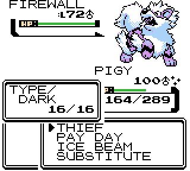
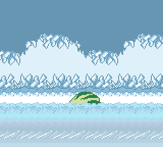
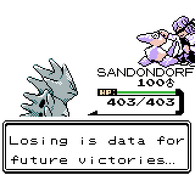

2.5.9
--------------
## Preface:

I, uh, have a decent bit to say. And I think this is the best place for it, because I know that not everyone who reads these is also in the Discord, and I think it should persist somewhere if that service doesn't.

You may think that the gaps between updates and decline in amount of content in each one would speak to how I feel about the state of the game; while this is a little true on its own, in this last year I have been enacting a very specific experiment. While I've been doing the best I can to eventually eliminate any reported bugs, I have also been actively looking for anything in Crystal Clear that still _personally_ bugs me.

Now, this isn't all that new. I'm always looking for that spark of creativity (or nagging, unrelenting madness) to latch onto in order to catapult out a bunch of optimizations just to have the space to enhance the overall experience in any way I can, but oddly, and _possibly_ for the first time ever, I've felt... content(?) with how everything is set up in Crystal Clear. And that's honestly new and unusual for me. The usual is "funny sparks coming out of the machine when in motion," but here it is, well oiled and making minimal noise. This is the first time I've actively looked for opportunities and come back empty handed.

However, I am still _extremely_ _hesitant_ to say anything stupid like "this will be the last update!!!" There is always potential that unforeseen consequences come along that bring forth another one before all is said and done, and I make no attempt at believing that there won't come a time where I find something that I just absolutely have to do, but... As many of you know, I now have an unrelenting, all-encompassing drive to bring my next project to fruition. And with that, I _do_ feel confident in saying that there is a certain point in time where it will require that I drop support for Crystal Clear entirely, either due to said project's generally overwhelming nature, or for much more complicated and unfortunate reasons.

Ultimately, what I want to say is that I've been doing the best I can to keep my favorite shiny swiney green and pristine, and I'm hoping that these last few little updates have polished him up enough so that he'll shine for the rest of time with no further adjustments...if that's truly where we're at now. 

I've really enjoyed every aspect of Crystal Clear, and have learned an incalculable amount, but I've come a long way from a seven month hack made only for a small forum back in 2017. And having seen the top of the mountain, to climb the next; I must first climb down this one. 

The outpouring of support in these past few years have been nothing short of unexpectedly lifechanging. I couldn't have kept going without all of you on the other end: playing the game, sharing it with others, and sharing this whole experience with me. I hope that Crystal Clear has made you proud; whether you're a supporter, fan, or friend. I hope that you've enjoyed it, and will continue to enjoy it for the rest of your life, whether that be by playing the game or just remembering the good times with it that you had.

As I continue to move forward with this next project, I would encourage you to check out the placeholder page on <https://shockslayer.com> - it may not look like much now, but it's the beginning of the next stage of my life's work, and I fully intend to go even harder on that than I did on this, using everything that I've learned. I'll be sure to sound as many alarms as I can once that begins to take shape, so you don't miss it: I know I won't be able to pull it off without your support.

ANYWAYS LMAO

This is mostly bug fixes and minor balance tweaks, but I did sneak some minor QoL in under the radar. 

## Quality of Life:

 - Thief now knocks the item out of the enemy's hands for later collection when used outside of link battles.

*Combine this with the Compound Eyes Pseudo Ability and Chaining. Trust me.*

 - Added SUPER NERD COSMO to the randomized Underground Arena trainers, to increases the chance that the Power Bom music will be unlocked during a single run of the arena, if RANDY isn't encountered.

 - Added a few more secrets to Cherrygrove Bay.

 - Added an easter egg with Pigy if you understand the fundamental mechanics behind Crystal Clear's advanced features.

## Battle Tutor Updates:

That's right, we're still slidin' 'em in this late in the game. But hey! Now Aipom has some increased catcher quality, and some other boring competitive stuff whatever.

 - Aipom: +Lovely Kiss, +False Swipe
 - Dodrio: -Swords Dance
 - Fearow: +Swords Dance
 - Machamp: -Swords Dance, +Mach Punch
 - Ursaring: +Swords Dance

## Fixes:
 - Fixed Pigy not rendering correctly due to his increased acceleration
 - Fixed one of the Ruins of Alph puzzles not working correctly
 - Fixed having a follower dig out of the Forest Path working incorrectly
 - Moved a Maniac on Route 42 over one tile for similar reasons
 - Fixed the Day Care menu account option incorrectly displaying gender in some cases
 - Adjusted a footprint location on Route 25 that was too close to the map border
 - Fixed Battle Tutor not checking for HMs
 - Fixed the Region Map and Unown Tablet having odd behavior when attempting to sell them
 - Fixed evolution stones and the Tradeback Guy circumventing Nuzlocke handling
 - Fixed attempting to print Unown forms and the Cianwood Photographer softlocking Stadium 2
 - Fixed music system causing inconsistent behavior in the intro sequences
 - Several text fixes
 

 
*It's over... After everything...This feels... This feels... Anticlimact-*