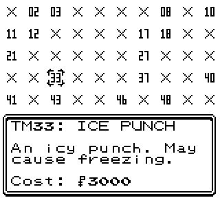

2.6.0
--------------
## Preface

2025 didn't see any updates, for the reasons previously outlined in the [2.5.9 changelog preface.](2_5_9_Changelog.md#Preface) I have been steadily working on my next project, which I've written a decent bit about on [shockslayer.com](https://shockslayer.com) for anyone curious.

**2.6.0** sees a handful of bugs squashed, but more importantly comes with a reworked TM Shop interface and some new music. I want to extend a special thanks to CosmicAngel, who not only offered to optimize some of the older music tracks that needed it, but even entirely remade a few to sound significantly better and use less space. Even just the bugfixes for this update wouldn't have fit in the remaining space, so 2.6.0 couldn't have happened without him.

All things considered, one of the previous updates was probably a better candidate for the "2.6.0" version designation. For this one, we'll go with a "better late than never" approach.

## Reworked TM Shop

CC's TM shop has basically been the same since the first release of the game. It functioned based on how many badges you obtained, with all four sets of TMs eventually unlocked after obtaining the first eight badges. While this was a little clunky, it was functional enough for the earlier versions of the game and better than the original approach.

However, as CC developed over the years, more TMs could be found in the overworld, and new ways to play the game emerged. These changes began to highlight a core issue with the TM system as a whole: if you obtained a TM elsewhere in the world, you couldn't then immediately go buy another copy of it; you'd still need to obtain the correct amount of badges.

This has now been addressed. **Individual TMs in the TM shop are now also unlocked when you obtain them in any way in the overworld**, and eventually all of them will unlock as you obtain badges, just like the original set system. There is also a new interface, so you don't need to remember which TM is in which set.

Additionally, Thief is now available as part of the initially unlocked TMs.

*The situation should now be improved. Good luck!*

## New Music

Two tracks have been replaced with new variants from CosmicAngel; the Ho-Oh battle theme, and the X/Y Gym Leader theme.

[Battle vs. Ho-Oh](https://soundcloud.com/cosmic-angel-685406146/ho-oh-8-bit-gbc-remix)

[X/Y Gym Leader Theme](https://soundcloud.com/cosmic-angel-685406146/kalos-leader)

Additionally, there was enough space leftover to include a new option for wild battle music:

[Area Zero Battle](https://soundcloud.com/cosmic-angel-685406146/pokemon-scarlet-and-violet)

I hope you all enjoy these tracks as much as I do.

## Tweaks

 - In Nuzlocke mode, with Disable Held Items active, trade evos will no longer require held items when traded to evolve.

 - A small note was added on the wall in Honeybun's house.

## Fixes

I didn't quite get to some of the emulator-specific SGB Border issues in time; you can always open the start menu and press SELECT to refresh it if you happen to run into any of these.

 - When doing New Game+, the special Traded Nickname Palette will be preserved.
 - The Legality Fixer will no longer try to check a Smeargle's moveset.
 - Minor text fix for Oak's Lab.
 - Minor text fix for a specific follower interaction.
 - Fixed the Underground Arena incorrectly restoring items in Nuzlocke mode when a party member is lost.
 - Fixed footprints on Route 43 being too close to the map connection.
 - Fixed the Goldenrod Cafe meal cutscene with the follower causing NPCs to appear on top of the textbox.
 - Fixed followers digging back to Azalea Town from Ilex Forest walking into the trees.
